# Vérification de la qualité des données (2022)

Pour tester la qualité des capteurs, je me base sur le nombre de ligne que ceux-ci doivent générer sur 7 jours et sur l'apparence des graphes.

Nombre de lignes souhaité : (7 * 24 * 3600) / 5 = 120 960

## participant 13 - kit 3
- PMScan (135769) :
  - temps d'utilisation : 7H 32 min (452 minutes soit 27120 secondes) + 35 mins (soit 2100 secondes) + 10 mins (soit 600 secondes) + 4H 42 mins (282 minutes soit 16920 secondes) + 78 mins (soit 4680 secondes) = 51 420 secondes
  - nombre de lignes obtenu : 4673 lignes
  - pourcentage de couverture : 3.9 %
  - le graphe des données présente des nombreuses courbes linéaires

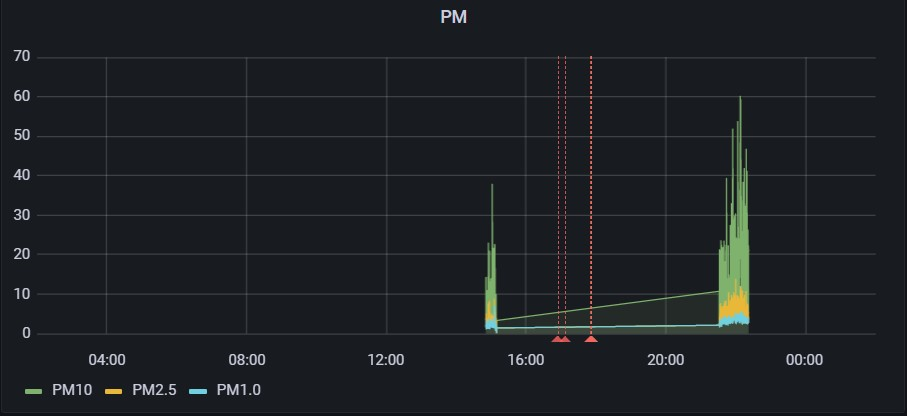

## participant 14 - kit 4
- PMScan (1386E7 / 138637)
  - temps d'utilisation : 3H 25 mins (205 minutes soit 12300 secondes) = 12300 secondes
  - nombre de lignes obtenu : 2465
  - pourcentage de couverture : 2 %
  - le graphe ne présente pas de courbes linéaires mais le capteur a été utilisé sur une période très courte

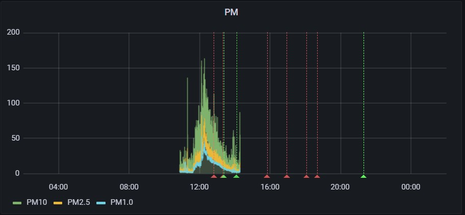

## participant 15 - kit 5
- PMScan (1386DC)
  - le temps d'utilisation n'est pas fournis mais il est précisé que les données sont partielles
  - nombre de lignes obtenu : 133
  - pourcentage de couverture : 0.1 %
  - les graphes du capteur comporte de nombreuses courbes linéaires et des données sur des laps de temps très courts

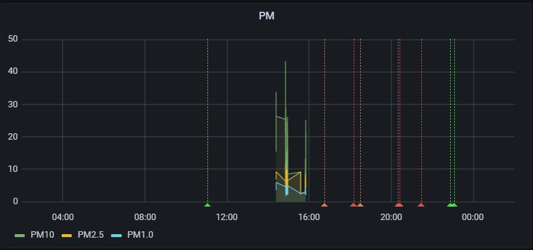

## participant 16 - kit 6
- PMScan (138715)
  - temps d'utilisation : 1H 47 mins (107 minutes soit 6420 secondes) = 6420 secondes
  - nombre de lignes obtenu : 44075
  - pourcentage de couverture : 36.4 %
  - le graphe du capteur quelques anomalies quand il est utilisé sur de longues périodes

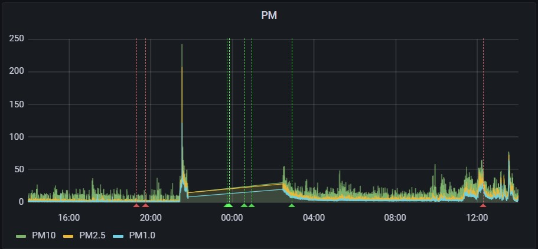

## participant 17 - kit 7
- PMScan (648F8B)
  - le temps d'utilisation n'est pas fournis mais il est précisé que les données sont partielles
  - d'après le graphe du capteur, il a été utilisé entre le 17/05/2022 à 07:06:18 et le 20/25/2022 à 19:43:20 sans aucune pause ou interruption
  - temps d'utilisation : 3j 12H 37 mins 2 secondes = 261422 secondes
  - nombre de lignes obtenu : 60837
  - pourcentage de couverture : 50.3 %
  - le graphe du capteur ne présente pas de courbe linéaire pendant toute la durée d'utilisation

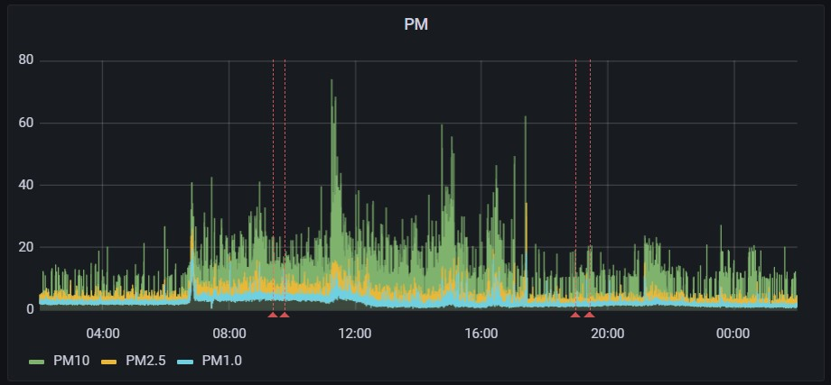

## participant 18 - kit 8
- PMScan (64BDD7)
  - le temps exacte d'utilisation n'est pas fournis
  - nombre de lignes obtenu : 2665
  - pourcentage de couverture : 2.2 %
  - le graphe du capteur présente des courbes linéaires pouvant durer plusieurs heures

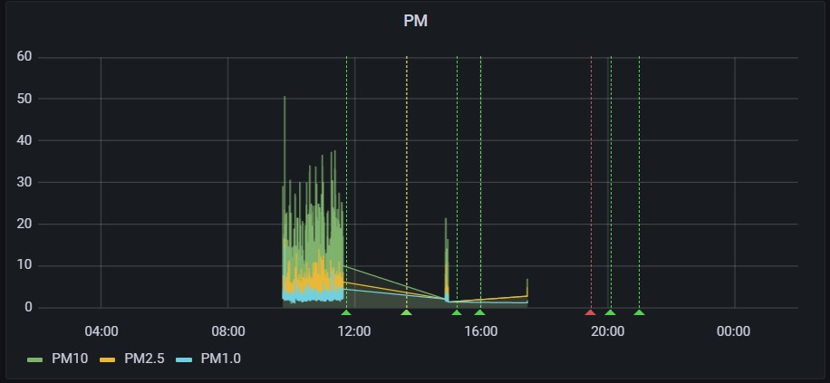

## participant 19 - kit 9
- PMScan (64BDE1)
  - le temps d'utilisation n'est pas renseigné
  - d'après le graphe du capteur, il a été utilisé en continue entre le 14/05/2022 à 09:11:45 et le 21/05/2022 à 09:37:24
  - temps d'utilisation : 7j 00H 25 mins 39 secondes = 604895 secondes
  - nombre de ligne obtenu : 120991
  - pourcentage de couverture : 100 %

## participant 110 - kit 10
- PMScan (648FB1)
  - le temps exacte d'utilisation n'est pas renseigné
  - le capteur n'a été utilisé que sur des temps courts.
  - nombre de lignes obtenu : 171
  - pourcentage de couverture : 0.1 %
  - le graphe du capteur présente des courbes linéaires sur des durées supérieurs à 2 heures

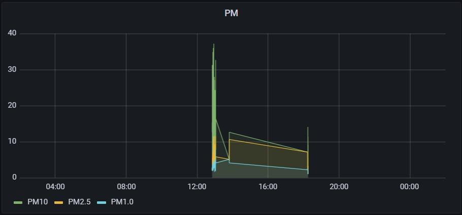

## participant 111 - kit 11
- PMScan (648F74)
  - le temps exacte d'utilisation n'est pas renseigné
  - d'après le graphe du capteur, il a été utilisé en continue entre le 16/05/2022 à 11:44:59 et le 20/05/2022 à 01:40:06
  - temps d'utilisation : 3j 13H 55 mins 07 secondes = 414307 secondes
  - nombre de lignes obtenu : 59122
  - pourcentage de couverture : 48.9 %
  - le graphe du capteur présentes des courbes linéaires sur des laps de temps très courts

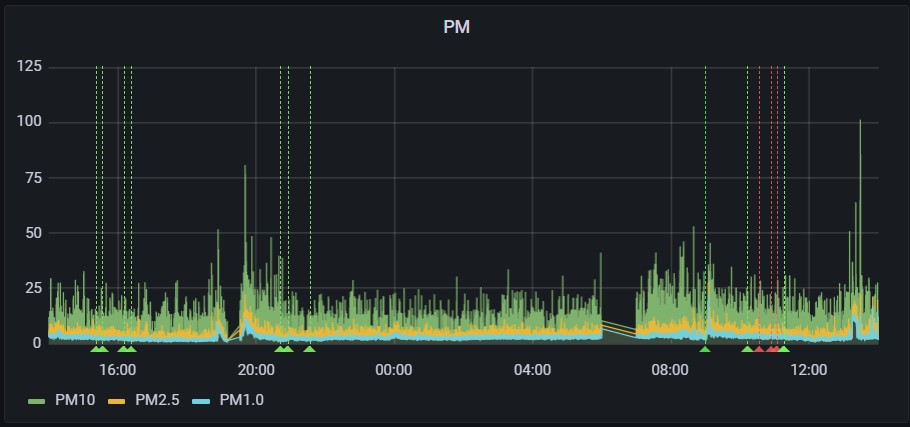

## participant 112 - kit 12
- PMScan (64BF71)
  - le temps exacte d'utilisation n'est pas renseigné
  - nombre de lignes obtenu : 70381
  - pourcentage de couverture : 58.1 %
  - le graphe du capteur présente régulièrement des courbes linéaires sur des laps de temps plus ou moins longs

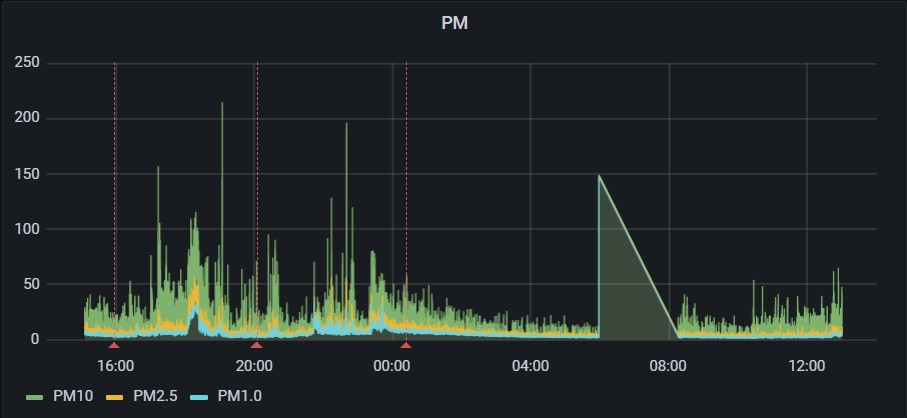

## participant 113 - kit 13
- PMScan (648DBA)
  - le temps exacte d'utilisation n'est pas renseigné
  - nombre de lignes obtenu : 552
  - pourcentage de couverture : 0.4 %
  - les intervalles d'utilisation du capteur sont trop courts pour permettre une évaluation de la qualité des données

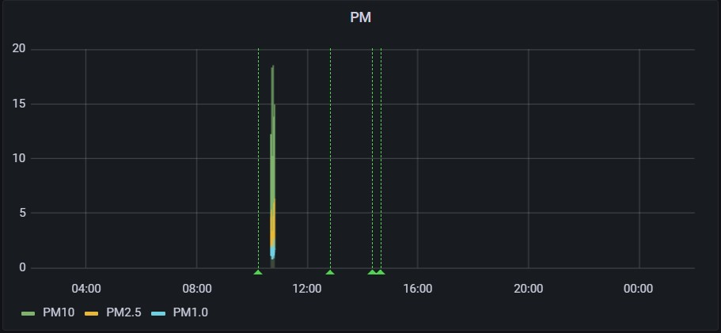

## participant 115 - kit 15
- PMScan (648DC9)
  - le temps exacte d'utilisation n'est pas renseigné
  - nombre de lignes obtenu : 103232
  - pourcentage de couverture : 85.3 %
  - le graphe du capteur présente régulièrement des courbes linéaires

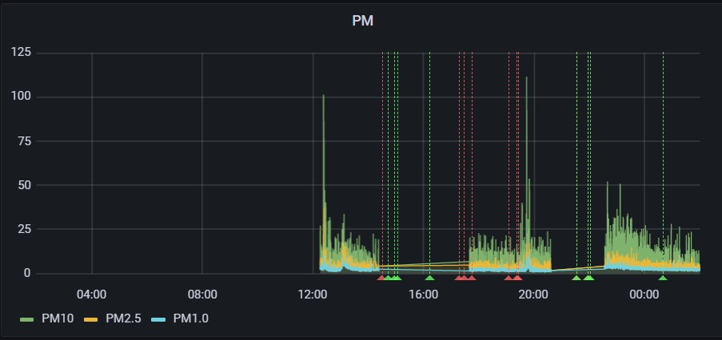

## participant 116 - kit 16
- PMScan (648973)
  - le temps exacte d'utilisation n'est pas renseigné
  - nombre de lignes obtenu : 101104
  - pourcentage de couverture : 83.5 %
  - le graphe du capteur ne semble pas présenter de courbes linéaires pendant toute la durée de son utilisation mais il présente régulièrement des pics

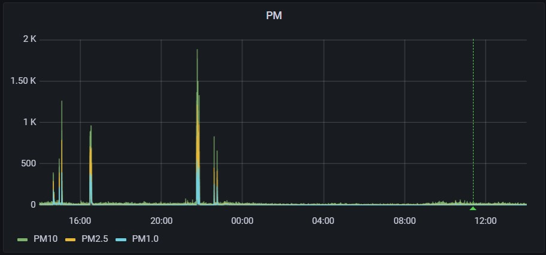