# Sommaire

- [Sommaire](#sommaire)
- [Résumé / Summary](#résumé--summary)
- [Introduction](#introduction)
- [<red>I. Présentation de l'organisme d'accueil</red>](#redi-présentation-de-lorganisme-daccueilred)
  - [<orange>I.A Historique</orange>](#orangeia-historiqueorange)
  - [<orange>I.B Présentation juridique de l'organisme d'accueil</orange>](#orangeib-présentation-juridique-de-lorganisme-daccueilorange)
  - [<orange>I.C Structure de l'organisme d'accueil</orange>](#orangeic-structure-de-lorganisme-daccueilorange)
  - [<orange>I.D Présentation de l'équipe de travail</orange>](#orangeid-présentation-de-léquipe-de-travailorange)
  - [<orange>I.E Étude de l'environnement économique de l'organisme d'accueil</orange>](#orangeie-étude-de-lenvironnement-économique-de-lorganisme-daccueilorange)
    - [<violet>1) Analyse PESTEL de l'environnement du laboratoire DAVID</violet>](#violet1-analyse-pestel-de-lenvironnement-du-laboratoire-davidviolet)
    - [<violet>2) Analyse SWOT du laboratoire DAVID</violet>](#violet2-analyse-swot-du-laboratoire-davidviolet)
- [<red>II. Présentation du travail accompli durant le stage</red>](#redii-présentation-du-travail-accompli-durant-le-stagered)
  - [<orange>II.A Présentation du Projet</orange>](#orangeiia-présentation-du-projetorange)
  - [<orange>II.B Description du travail réalisé</orange>](#orangeiib-description-du-travail-réaliséorange)
  - [<orange>II.C Description des problèmes à traiter et des solutions</orange>](#orangeiic-description-des-problèmes-à-traiter-et-des-solutionsorange)
    - [<violet>Étape 1 : Comprendre la structure de la plateforme</violet>](#violetétape-1--comprendre-la-structure-de-la-plateformeviolet)
    - [<violet>Étape 2 : Comprendre le fonctionnement basique de Python Flask</violet>](#violetétape-2--comprendre-le-fonctionnement-basique-de-python-flaskviolet)
    - [<violet>Étape 3 : L'implémentation de la méthode POST avec Python Flask</violet>](#violetétape-3--limplémentation-de-la-méthode-post-avec-python-flaskviolet)
    - [<violet>Étape 4 : Modifier la page web en fonction des actions de l'utilisateur</violet>](#violetétape-4--modifier-la-page-web-en-fonction-des-actions-de-lutilisateurviolet)
    - [<violet>Étape 5 : Permettre le changement de page par l'utilisation de liens</violet>](#violetétape-5--permettre-le-changement-de-page-par-lutilisation-de-liensviolet)
    - [<violet>Étape 6 : Permettre la connexion et les interactions avec la base de données PostgreSQL</violet>](#violetétape-6--permettre-la-connexion-et-les-interactions-avec-la-base-de-données-postgresqlviolet)
    - [<violet>Étape 7 : Sécuriser les interactions avec la base de données</violet>](#violetétape-7--sécuriser-les-interactions-avec-la-base-de-donnéesviolet)
    - [<violet>Étape 8 : Vérifier si les données insérée par le client sont déjà dans la base de données</violet>](#violetétape-8--vérifier-si-les-données-insérée-par-le-client-sont-déjà-dans-la-base-de-donnéesviolet)
  - [<orange>II.D Les outils informatiques et techniques utilisés</orange>](#orangeiid-les-outils-informatiques-et-techniques-utilisésorange)
  - [<orange>II.E Méthodes, formations et autoformations suivies pour l'obtention de la solution</orange>](#orangeiie-méthodes-formations-et-autoformations-suivies-pour-lobtention-de-la-solutionorange)
  - [<orange>II.F Résultats</orange>](#orangeiif-résultatsorange)
- [Annexes](#annexes)
    - [**Code 2.1.1 :** fichier ```templates/index.html```](#code-211--fichier-templatesindexhtml)
    - [**Code 2.1.2 :** fichier ```app.py```](#code-212--fichier-apppy)
    - [**Code 2.2.1 :** fichier ```templates/index.html``` avec un formulaire](#code-221--fichier-templatesindexhtml-avec-un-formulaire)
    - [**Code 2.2.2 :** fichier ```app.py``` permettant de recevoir des éléments avec la méthode POST](#code-222--fichier-apppy-permettant-de-recevoir-des-éléments-avec-la-méthode-post)
    - [**Code 2.3.1 :** fichier ```templates/index.html``` avec un affichage conditionnel](#code-231--fichier-templatesindexhtml-avec-un-affichage-conditionnel)
    - [**Code 2.3.2 :** fichier ```app.py``` avec passage de paramètre par le dictionnaire ```post```](#code-232--fichier-apppy-avec-passage-de-paramètre-par-le-dictionnaire-post)
    - [**Code 2.4.1 :** fichier ```index.html``` avec un lien vers la page comportant l'URL ```page2```](#code-241--fichier-indexhtml-avec-un-lien-vers-la-page-comportant-lurl-page2)
    - [**Code 2.4.2 :** fichier ```page2.html``` accessible par un lien](#code-242--fichier-page2html-accessible-par-un-lien)
    - [**Code 2.4.3 :** fichier ```app.py``` avec la fonction ```page2``` permettant l'affichage de la page correspondant au fichier ```page2.html```](#code-243--fichier-apppy-avec-la-fonction-page2-permettant-laffichage-de-la-page-correspondant-au-fichier-page2html)
    - [**Code 2.6.1.1 :** fichier ```index.html```](#code-2611--fichier-indexhtml)
    - [**Code 2.6.1.2 :** fichier ```app.py```](#code-2612--fichier-apppy)
    - [**Code 2.6.2.1 :** fichier ```app.py``` avec les éléments pour empêcher une injection SQL](#code-2621--fichier-apppy-avec-les-éléments-pour-empêcher-une-injection-sql)
- [Joural des mises à jour de la plateforme de données Polluscope](#joural-des-mises-à-jour-de-la-plateforme-de-données-polluscope)
- [Sitographie](#sitographie)
- [Bibliographie](#bibliographie)

<div style="page-break-after: always"></div>

# Résumé / Summary

Je suis rentré au laboratoire DAVID de l'Université de Versailles-Saint-Quentin-en-Yvellines dans le cadre de mon stage de fin d'étude à l'IUT Informatique de Vélizy. Le stage a pour sujet <und>Développement d'interfaces de chargement, de prétraitement et de visualisation de données issues d'un capteur et d'une application mobile</und> et s'est déroulé du 4 avril au 27 mai 2022. Durant cette période j'ai participé au projet de recherche Polluscope en créant un programme pour générer des rapports de façon automatique et en refactorisant la plateforme de données du projet en langage Python Flask.

I entered in the DAVID laboratory of the Université de Versailles-Saint-Quentin-en-Yvellines in the context of my internship of end studies in computer sciences at the IUT of Velizy. The internship subject is <und>Development of loading, pretreatement and visualization interface for data from sensor and of mobile application</und> and took place between April 4th and may 27th of 2022. During this time, I participated to the research project Polluscope by creating a program of auto report generation and by refactoring the project's data platform in the Python Flask language.

<div style="page-break-after: always"></div>

# Introduction

Le présent rapport a pour fonction de présenter l'entreprise ayant accepté de m'embaucher pour mon stage de fin d'étude en IUT informatique. \
J'ai été accepté au **laboratoire DAVID de l'Université de Versailles-Saint-Quentin-en-Yvellines** en répondant à l'offre de stage <und>Développement d'interfaces de chargement, de prétraitement et de visualisation de données issues d'un capteur et d'une application mobile</und> de l'équipe ADAM. \
Ce stage a débuter le 4 avril 2022 et a duré deux mois. Ce stage constitue ma première expérience dans le milieu professionnel en tant que membre actif d'une organisation et a pour objectif de valider mes deux ans d'étude à l'IUT informatique de Vélizy et d'obtenir le Diplôme Universitaire de Technologie en Informatique. \
Dans un premier temps nous verrons une présentation du laboratoire DAVID de l'UVSQ avant de présenter le travail effectué durant la période de stage puis de finir par une conclusion récapitulant ce que le stage m'a appris et apporté.

<div style="page-break-after: always"></div>

# <red>I. Présentation de l'organisme d'accueil</red>

Dans cette partie, nous allons voir une présentation générale du laboratoire avant d'évoquer sa dimension juridique suivie de sa structure organisationnelle, d'une présentation de l'équipe avec laquelle j'ai effectué le stage pour finir avec une étude de l'environnement économique du laboratoire.

issue du prisme. laboratoire projet ciblé sur données et algo, centrer ville intelligente

## <orange>I.A Historique</orange>


Le **laboratoire DAVID de l'Université de Versailles-Saint-Quentin-en-Yvellines** (Données et Algorithme pour une Ville Intelligente et Durable) se situe dans le bâtiment Descartes du campus de l'Unité de Formation et de Recherche (UFR) des Sciences de la ville de Versailles (78000). Il été fondé en juillet 2015 à l'initiative des membres du laboratoire PRISM pour créer un laboratoire spécialiser en algoritmique et en science de la donnée dont l'objectif est de concevoir une ville écologiquement responsable.


## <orange>I.B Présentation juridique de l'organisme d'accueil</orange>

Le laboratoire regroupe 60 chercheurs et doctorants spécialisés dans la recherche en informatique et plus particulièrement dans les domaines du big data, de la sécurité des données, de l'algorithmique, des réseaux de télécommunication et travail en interdisciplinarité avec la fédération **SIHS** (Sciences Informatiques, Humaines et Sociales) du CNRS dans l'objectif de concevoir une ville durable et intelligente. \
La majorité des ressources financières du laboratoire proviennent de l'État et varient en fonction de la période ou du nombre de projet en cours et du coût de ceux-ci. Dans le cas du projet de recherche Polluscope (voir [Présentation du projet](#orangeiia-présentation-du-projetorange)), celui-ci à généré une aide financière de 172 721 € provenant de l'État et des financements 694 988 € provenant des partenaires du laboratoire dans le cadre du projet.

## <orange>I.C Structure de l'organisme d'accueil</orange>

La direction du laboratoire est assurée par le professeur **BARTH Dominique**, **KEDAD Zoubida** et **DUCOIN Chantal** ayant respectivement les postes de directeur du laboratoire, directrice adjointe et responsable administrative. La gestion des équipes de recherches du laboratoire est répartie entre **BARTH Dominique** pour l'équipe **ALMOST**, **ANCIAUX Nicolas** pour l'équipe **PETRUS** et **ZEITOUNI Karine** pour l'équipe **ADAM**. L'équipe **NGN** récemment rattachée au laboratoire est quant à elle dirigée par **AITSAADI Nadjib**.

<div style="page-break-after: always"></div>

## <orange>I.D Présentation de l'équipe de travail</orange>

Le laboratoire regroupe les équipes de recherches **ALMOST** (Algorithms and Stochastic Models), **PETRUS** (PErsonnal and TRUSted cloud), **NGN** (Next Generation Network) et **ADAM** (Ambient Data Access and Mining) avec laquelle j'ai réalisé le stage. Celles-ci sont majoritairement constituées de chercheurs ou d'étudiants doctorants et on respectivement pour spécialités la résolution algorithmique et l'évaluation de performance, la structure, la gestion et la sécurisation de données personnelles, les réseaux et l'internet des objets et la modélisation de données hétérogènes.

Dans le cadre de mon stage, j'ai travaillé au sein de l'équipe ALMOST sous la direction de **ZEITOUNI Karine**, la cheffe du groupe et également ma tutrice de stage ainsi qu'une des professeurs rencontrées durant mes études à l'IUT informatique de Vélizy.


Elle fait parti des membres permanents de l'équipe au même titre **TAHER Yehia** (Maître de conférence), **YEH Laurent** (Maître de conférence). J'ai remarqué que parmi les membres permanents de l'équipe ADAM se trouvent **PREDA Nicoleta** et **LOYER Yann**, deux professeurs rencontrés durant mes études à l'IUT informatique de Vélizy.

Au sein de l'équipe, se trouvent également des étudiants doctorant ou post doctorant dont **BOUHAMOUM Redouane** un autre professeur de l'IUT de Vélizy. Par ailleurs, pendant la période de mon stage, deux membres du groupe de doctorants, **EL HAFYANI Hafsa** et **ZUO Jingwei**, ont soutenu leurs thèses devant un jury et obtenu le titre de Docteur en informatique. Quand le sujet de thèse est attribué à l'étudiant préparant un doctorat, il rejoint un des projets dont l'équipe est en charge. Celui-ci dépend du sujet de la thèse, de sa compatibilité avec celle-ci, et ce que l'étudiant peut apporter au projet avec ses travaux de recherche.

Aussi, dans le cadre de certains projet ou pour des exigences précises, le laboratoire recrute des étudiants devant réaliser des stages en entreprises dans le cadre de leurs étude. J'ai fait parti de cette catégorie en rejoignant le laboratoire, au même titre que **BADRA Riham**, une étudiante ayant rejoint l'équipe dans le cadre de son Master en Informatique.

Étant donnée que le laboratoire est en relation avec des universités à l'échelle mondiale, cela lui permet d'accueillir des étudiants stagiaires et doctorants venus du monde entier.

<div style="page-break-after: always"></div>

## <orange>I.E Étude de l'environnement économique de l'organisme d'accueil</orange>

Cette partie est entièrement dédiée à la présentation de l'environnement économique du laboratoire DAVID.

### <violet>1) Analyse PESTEL de l'environnement du laboratoire DAVID</violet>

L'ensemble des opportunités et menaces pesant sur le laboratoire DAVID sont résumée dans la matrice PESTEL ci-dessous. \
<und>PESTEL :</und> Politique, Économique, Socio-culturel, Technologique, Environnemental, Légal

|Dimension  |Opportunité    |Menace |
|---|---|---|
|Politique|- la <und>loi de programmation de la recherche</und> promet 3% du PIB consacré à la recherche et une meilleure organisation de celle-ci|- depuis mai 2021, le <und>Plan National de Recherche</und> sélectionne les proposition de projet de recherche en fonction de leurs impacts sociétaux, ce qui réduit le nombre projets financés|
|Économique||- pénurie mondiale de composants informatiques en raison de la crise du Covid-19<br>- les fortes dettes de l'État réduisent les possibilités de financement|
|Socio-culturel|- prise de conscience de l'importance des principes du développement durable<br>- prise de conscience des enjeux environnementaux ||
|Technologique|- amélioration constante des technologies de l'information pour le public et les entreprises<br>- la quantité de donnée augmente constamment et des travaux de recherche sont nécessaire pour optimiser leur traitement<br>- de plus en plus d'appareils interagissent grâce à internet|- pénurie mondiale de composants informatiques en raison de la crise du Covid-19|
|Environnemental|- la dégradation de l'environnement nécessite des recherche pour en connaître les conséquences et les moyens de les diminuer|- on sait depuis peu de temps que le stockage massif de données est facteur d'augmentation de la pollution<br>- la production d'ordinateur a des conséquences néfastes sur l'environnement|
|Légale|||

**Tableau 1 :** Matrice PESTEL de l'environnement du laboratoire DAVID

L'actualité sur le plan technologique est globalement favorable au bon fonctionnement du laboratoire car l'utilisation massive des réseaux de télécommunication et des bases de données nécessite des travaux de recherche pour les rendre toujours plus performants. Néanmoins, d'un point de vue économique, étant donné les fortes dettes de l'état français, celui-ci possède moins d'argent pouvant être investi dans la recherche scientifique. De plus, les enjeux écologiques actuels nécessite des travaux de recherche pour prévenir les conséquences de la pollution de l'air ou pour réduire l'impact des nouvelles technologies sur l'environnement.

<div style="page-break-after: always"></div>

### <violet>2) Analyse SWOT du laboratoire DAVID</violet>

<und>SWOT :</und> Strengths, Weaknesses, Opportunities, Threats (Forces, Faiblesses, Opportunités, Menaces)

L'ensemble des forces, faiblesses, opportunités et menaces du laboratoire DAVID sont résumés dans le tableau suivant et proviennent majoritairement du document d'évaluation HCERES de 2018 (voir [Bibliographie](#bibliographie)).

|Aspect |Description    |
|---|---|
|**Forces**|- spécialisation du laboratoire dans le domaine de l'informatique<br>- le laboratoire est en lien avec plusieurs centres de recherches de l'UVSQ et du territoire français<br>- le laboratoire est en lien avec des universités à l'échelle international (Liban, Chine ...) et accueil des étudiants et doctorants venus du monde entier<br>- les activités de recherche du laboratoire se basent sur plusieurs thèmes liés à des défis sociétaux actuellement majeurs<br>- collaboration avec des acteurs territoriaux au niveau des communautés d'agglomération, du département des Yvelines et de la région Ile-de-France|
|**Faiblesses**|- effectif réduit par rapport à d'autres laboratoires de recherches<br>- peu de moyens et absence de soutien politique de la part de l'UVSQ<br>- difficulté pour les membres du laboratoire à investir dans des projets de recherche|
|**Opportunités**|- le laboratoire de recherche **NIWC** (Naval Information Warafare Center) des États-Unis est à la recherches d'étudiants, doctorants et chercheurs compétents dans les domaines de l'informatiques, essentiellement dans le big data<br>- la <und>loi de programmation de la recherche</und> promet 3% du PIB consacré à la recherche et une meilleure organisation de celle-ci|
|**Menaces**|- depuis mai 2021 et l'apparition du <und>Plan National de Recherche</und>, le gouvernement sélectionne les proposition de projet de recherche en fonction de leurs impacts sociétaux, ce qui réduit le nombre projets financés par l’État<br>- baisse de motivation des membres du laboratoire dans l'investissement pour l'obtention des moyens de recherche|

En France, les principaux organismes de recherche sont l'**INRA** (Institut National de la Recherche Agronomique), l'**INSERM** (Institut National de la Santé Et de la Recherche Médicale) et le **CNRS** (Centre National de la Recherche Scientifique) reconnu par son nombre de publications scientifiques comme le premier organisme de recherche au monde.


<div style="page-break-after: always"></div>

# <red>II. Présentation du travail accompli durant le stage</red>

Dans cette partie, nous allons évoqué le travail effecuté durant le stage en commençant par une description dur projet, suivi d'une description des tâches réalisées, d'une mise en évidance des principaux problèmes rencontrés, d'une présentation des outils utilisés, des méthodes et formations suivies pour finir par l'analyse des résultat de chaque tâches.

## <orange>II.A Présentation du Projet</orange>

Le stage s'est déroulé dans le cadre du projet de recherche **Polluscope** (voir [sitographie](#sitographie)) dont l'équipe ADAM du laboratoire DAVID est en charge depuis le 1er septembre 2016 jusqu'à la date limite du projet, le 31 décembre 2022. Celui-ci à pour objectif de mesurer l'exposition à la pollution de la population française au quotidien.


Pour ce faire, des campagnes de recensement sont régulièrement réalisées en région parisienne et marseillaise avec la participation de volontaires. Pour les besoins de l'expérience, chaque participant reçoit de un ou plusieurs capteurs de pollution et une tablette dans certains cas pour relever leurs activité ainsi que leur position géographique. Les capteurs sont conçu pour mesurer le taux de particules fines de différentes tailles dans l'air ambiant et transférer les données sur une application. Celles-ci peuvent ensuite être téléchargés et déposées sur le site internet du projet pour être analysées et mise sous différentes formes. \
Dans certaines conditions, des stations fixes sont utilisées pour mesurer la pollution de l'air ambiant. Toutefois, dans la mesure où celles-ci sont difficiles à déplacer, elles sont surtout utilisées comme témoins de la pollution dans des zones rurales ou peu urbanisées.

## <orange>II.B Description du travail réalisé</orange>

Mon premier travail durant le stage est de créer le programme permettant la <und>génération des rapports</und>. La création des graphes de visualisation de données ayant été réalisée en langage Python par **EL HAFYANI Hafsa**, je dois utiliser ce même langage pour créer des rapports de façon automatique. J'ai également pour contrainte de générer une première version des rapports en Markdown avant de les convertir en PDF. \
Une autre partie de mon travail est de créer une <und>nouvelle version de la plateforme de données Polluscope</und> permettant le dépôt des données de pollution, le téléchargement de fichier de données et le téléchargement des rapports. Une première version du site à été codé en PHP par **TAHER Yehia**. Cependant, pour répondre à un besoin d'homogénéisation des langages utilisés, notamment par rapport à la génération automatique des rapport, il faut que je créer une version du site internet en utilisant les langages Python et HTML ainsi que le framework Flask et la base de données Postgres du laboratoire sur laquelle sont stockées les données de pollution. Il faut également que je déploie cette nouvelle version de la plateforme en utilisant la technologie Docker. \
La dernière partie de mon travail sera de <und>créer une application mobile</und> selon un modèle similaire à celui du site internet évoqué précédemment.

Aussi, une partie de mon travail durant le stage à été de participer à une campagne de recensement de la pollution. Pour cela, en plus de l'application nécessaire que j'ai téléchargé sur mon téléphone, j'avais à ma disposition un capteur FLOW. Cela m'a permis de connaître mon exposition à la pollution au cours d'une journée de stage.

<div style="page-break-after: always"></div>

## <orange>II.C Description des problèmes à traiter et des solutions</orange>

Cette section du rapport est entièrement consacrée à la description détaillée des problèmes rencontrés durant la refactorisation de la plateforme de données Polluscope qui constitue mon travail le plus important durant le stage. Cette partie présente également les solutions découvertes ou mises au points pour résoudre ces problèmes.

Dans cette partie, les références aux portions code présents en annexes sont entre parenthèses.

### <violet>Étape 1 : Comprendre la structure de la plateforme</violet>

Étant donné qu'une première version de la plateforme à été créée en PHP par **TAHER Yehia** et **Ahmad Ktaish**, il fallait que je respecte la structure de l'application mais aussi sa charte graphique. Pour visualiser la structure du site internet et mieux comprendre son fonctionnement, j'ai créer un schéma comportant des balises représentant les différentes pages de la plateforme ainsi que les liens entre celles_ci.

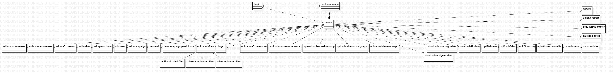 \
**Schéma 1 :** Schéma de la structure de la plateforme de donnée Polluscope

En examinant le code source de la plateforme, on constate qu'il est nécessaire d'avoir un compte enregistré dans la base de donnée pour utiliser les services du site internet. On peut également remarquer qu'un utilisateur peut avoir soit un rôle de participant, soit un rôle d'administrateur et que cela influe sur les actions réalisables par la personne qui se connecte à la plateforme.

### <violet>Étape 2 : Comprendre le fonctionnement basique de Python Flask</violet>

Afin d'apprendre à créer un site internet en Python Flask j'ai recherché sur internet des contenus expliquant la structure et le fonctionnement de ce dernier. \
La liste des lien dont je me suis servis pour cette auto formation sont présents dans la [sitographie](#sitographie).

D'après mes recherches, la technologie Flask a un fonctionnement semblable au Design Pattern **Modele-View-Controller** (Modèle-Vue-Contrôleur) utilisé dans les langages de programmation orientés objets. En effet, l'affichage des pages codées en HTML ainsi que les actions de l'utilisateur sur celles-ci sont ou peuvent être entièrement ou partiellement gérées par un seul fichier codé en Python.

Les deux portions de code [*2.1.1*](#code-211--fichier-templatesindexhtml) et [*2.1.2*](#code-212--fichier-apppy) présentes en annexe, permettent l'affichage d'une pages web identique à celle de l'image suivante : \
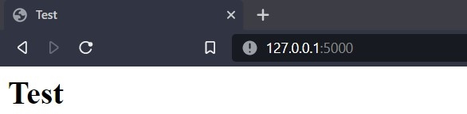

Pour cela, le fichier ```index.html``` ([Code *2.1.1*](#code-211--fichier-templatesindexhtml)) doit être placé dans un répertoire **templates** avant d'exécuter le fichier ```app.py``` ([Code *2.1.2*](#code-212--fichier-apppy)). Cela permet d'ouvrir une fenêtre de terminal comportant les lignes suivantes :
```
* Serving Flask app 'app' (lazy loading)
 * Environment: production
   WARNING: This is a development server. Do not use it in a production deployment.
   Use a production WSGI server instead.
 * Debug mode: off
 * Running on http://127.0.0.1:5000 (Press CTRL+C to quit)
```
Pour afficher la page web il faut entrer l'URL fourni (ici ```http://127.0.0.1:5000```) dans un moteur de recherche.

En sachant cela, j'ai pu créer la page d'accueil de la plateforme du projet.

### <violet>Étape 3 : L'implémentation de la méthode POST avec Python Flask</violet>

D'après l'analyse de la plateforme, celle-ci comporte de nombreux formulaires nécessaires aux dépôt des données de pollution. Tout comme dans la première version du site internet, celui que j'ai créer doit permettre la transmission d'éléments insérés dans des formulaires au moyen de la méthode POST. \
En reprenant le code HTML vu précédemment on peut rajouter un formulaire ([Code *2.2.1* #1](#code-221--fichier-templatesindexhtml-avec-un-formulaire)) constitué d'une zone de texte ([Code *2.2.1* #2](#code-221--fichier-templatesindexhtml-avec-un-formulaire)) et d'un bouton de validation ([Code *2.2.1* #3](#code-221--fichier-templatesindexhtml-avec-un-formulaire)). La méthode ```main()``` du fichier ```app.py``` ([Code *2.2.2*](#code-222--fichier-apppy-permettant-de-recevoir-des-éléments-avec-la-méthode-post)) qui permet l'affichage de la page web est par défaut à l'écoute des actions réalisées sur ce formulaire.

Avec le nouveau fichier ```index.html``` ([Code *2.2.1*](#code-221--fichier-templatesindexhtml-avec-un-formulaire)), on obtient une page web identique à celle-ci :


Afin que le programme en Python puisse recevoir des éléments avec la méthode POST, celle-ci doit être spécifiée grâce à la méthode ```@app.route()``` ([Code *2.2.2* #1](#code-222--fichier-apppy-permettant-de-recevoir-des-éléments-avec-la-méthode-post)). Pour récupérer les éléments insérés dans le formulaire, il faut utiliser l'attribut ```form``` de l'objet ```request``` en spécifiant le nom de l'élément ([Code *2.2.2* #2](#code-222--fichier-apppy-permettant-de-recevoir-des-éléments-avec-la-méthode-post)) après avoir vérifié si la méthode POST est utilisée ([Code *2.2.2* #3](#code-222--fichier-apppy-permettant-de-recevoir-des-éléments-avec-la-méthode-post)).

Avec les deux dernières portions de code présentée précédemment, on peut entrer du texte dans la zone dédiée et l'envoyer pour que celui-ci soit affiché dans un terminal.

Comprendre le fonctionnement de la méthode POST m'a permis de d'implémenter une première version de la page de connexion sans utilisation de la base de données.

### <violet>Étape 4 : Modifier la page web en fonction des actions de l'utilisateur</violet>

Durant l'analyse de la première version du site internet, j'avais constaté que le programme en PHP permet l'affichage de texte sur les pages web pour indiquer si des erreurs ont eu lieu ou si une action s'est achevés correctement. Afin que cela soit possible dans la nouvelles version de la plateforme je devais trouver un moyen pour passer des éléments en paramètre des fonction d'affichage des pages web. \
Pour ce faire, j'ai utilisé des éléments de syntaxe **Jinja** dans les pages web. Cela permet de créer des boucles ou des action conditionnels dans des pages codées en html. \
Dans le code [*2.3.1*](#code-231--fichier-templatesindexhtml-avec-un-affichage-conditionnel), si la fonction d'affichage de la page comporte un paramètre ```posts``` portant le label 'text' ([Code *2.3.1* #1](#code-231--fichier-templatesindexhtml-avec-un-affichage-conditionnel)) alors celui-ci est affiché sur la page web ([Code *2.3.1* #2](#code-231--fichier-templatesindexhtml-avec-un-affichage-conditionnel)).

Pour pouvoir passer un paramètre à la fonction d'affichage, un dictionnaire doit être instancié dans le script python ([Code *2.3.2* #1](#code-232--fichier-apppy-avec-passage-de-paramètre-par-le-dictionnaire-post)) et les éléments à passer en paramètre doivent être associés à la bonne clé ([Code *2.3.2* #2](#code-232--fichier-apppy-avec-passage-de-paramètre-par-le-dictionnaire-post)). Par défaut, l'élément associé à la clé doit être nul ([Code *2.3.2* #3](#code-232--fichier-apppy-avec-passage-de-paramètre-par-le-dictionnaire-post)) pour éviter des erreurs. Le dictionnaire doit ensuite être placé en paramètre de la méthode ```render_template()``` avec le nom approprié ([Code *2.3.2* #4](#code-232--fichier-apppy-avec-passage-de-paramètre-par-le-dictionnaire-post)).

Le code ainsi modifié permet d'afficher une page web similaire à la précédente mais à présent lorsque du texte est entré dans la zone appropriée et envoyé (#1), celui-ci est affiché dans le navigateur (#2). \
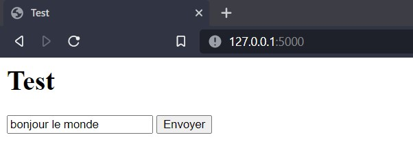 #1
 #2

L'affichage conditionnel sur des pages web m'a permis de modifier les pages accessibles aux utilisateurs en fonction de leurs rôle de participant ou d'administrateur.

### <violet>Étape 5 : Permettre le changement de page par l'utilisation de liens</violet>

La plateforme doit comporter un menu permettant l'accès à différentes pages en fonction des besoins de l'utilisateur et de ses actions à réaliser. Dans la version que j'ai créer, j'ai dû trouver une méthode permettant l'utilisation des liens spécifiés pour chaque fonctions rattachées à chaque pages. \
Pour ce faire, il faut utiliser un élément de syntaxe **Jinja** associé à la méthode ```url_for()``` ([Code *2.4.1* #1](#code-241--fichier-indexhtml-avec-un-lien-vers-la-page-comportant-lurl-page2)). Celle-ci doit avoir l'URL de la page souhaité en paramètre. \

Pour qu'une autre page HTML (ici celle du [Code *2.4.2*](#code-242--fichier-page2html-accessible-par-un-lien)) soit accessible par un lien, celle-ci doit être rattachée à une fonction ([Code *2.4.3* #1](#code-243--fichier-apppy-avec-la-fonction-page2-permettant-laffichage-de-la-page-correspondant-au-fichier-page2html)) et à un chemin d'accès ([Code *2.4.3* #2](#code-243--fichier-apppy-avec-la-fonction-page2-permettant-laffichage-de-la-page-correspondant-au-fichier-page2html)).

Les trois fichier permettent d'afficher une page comportant un titre et un lien. \
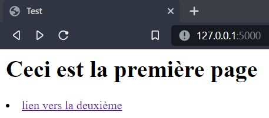

Cliquer sur le lien permet d'afficher la deuxième page. \
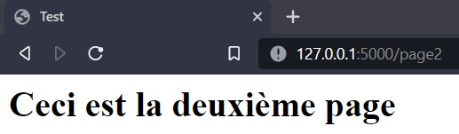

Avec ces éléments, j'ai pu créer le menu contenant les liens vers les différentes pages.

### <violet>Étape 6 : Permettre la connexion et les interactions avec la base de données PostgreSQL</violet>

Tout comme la première version de la plateforme, celle que j'ai créé doit pouvoir insérer, lire et modifier des éléments contenus dans une base de données PostgreSQL. \
Pour établir la connection avec la base de donnée, il est possible d'utiliser la commande python suivante avec le nom de la base de données, le nom d'utilisateur, le mot de passe de l'utilisateur et l'adresse IP du serveur ébergeant le système de gestion de base de données.

```py
import psycopg2

conn = psycopg2.connect(database="nom_base_de_données", user="nom_utilisateur", password="mot_de_passe", host="adresse_ip")
```
**Code 2.5.1 :** Commande de connection à la base de données PostrgreSQL

Pour exécuter une commande sur la base de données, il faut écrire cette dernière dans un objet de type String (#1) et le passer en paramètre de la méthode ```execute()``` du curseur (#2), attribut de la connection précédemment établie (#3).

```py
import psycopg2

conn = psycopg2.connect(database="nom_base_de_données", user="nom_utilisateur", password="mot_de_passe", host="adresse_ip")

query = "select * from test" #1
cur  = conn.cursor() #3
cur.execute(query) #2
```
**Code 2.5.2 :** Script Python permettant l'exécution d'une commande SQL sur une base de données PostgreSQL

Les résultats des requête SQL sont stocké dans la variable curseur sous forme de tableau. Pour visualiser les ligne générées par la requête, il faut donc afficher chaque élément de la variable curseur (#1) grâce à une boucle (#2).

```py
import psycopg2

conn = psycopg2.connect(database="nom_base_de_données", user="nom_utilisateur", password="mot_de_passe", host="adresse_ip", port= "port")

query = "select * from test"
cur  = conn.cursor()
cur.execute(query)

for row in cur: #2
    print(row) #1
```
**Code 2.5.3 :** Script Python permettant l'exécution d'une requête SQL et l'affichage des lignes générées

```
Output :
['test1']
['test2']
['test3']
```

Pouvoir interagir avec la base de donnée m'a permis de créer une nouvelle version de la page de connexion en utilisant les logins et mots de passe stockés dans la base de données. J'ai également pu créer des scripts Python pour enregistrer les donnée de pollution mais aussi ajouter des utilisateurs, des capteurs, des kits ou des campagnes.

### <violet>Étape 7 : Sécuriser les interactions avec la base de données</violet>

D'après mon analyse du code source de la première version de la plateforme Polluscope, les requêtes utilisée pour insérer des éléments dans la base de donnée étaient exécutées sans être préparées. En tant que passionné de cybersécurité, je sais qu'une requête SQL non préparée est une faille de sécurité pouvant être utilisée à des fins malveillantes pour compromettre une base de donnée grâce à des **injections SQL**. Il était donc primodiale que je corrige cette faille dans la nouvelle version du site internet.

Normalement, quand le client d'une page web insert un élément dans un champ prévu à cette effet tel qu'une zone de texte, celui-ci est récupéré et insérer dans la variable de type String qui constitue la commande SQL. Cette commande est ensuite exécutée sur la base de donnée. \
Dans les exemples suivants nous utiliserons la table ```personnes``` présentée ci-dessous :
```
 id |   nom
----+---------
  1 | Camille
  2 | Bruce
  3 | Selina
```

Les deux portions de code [*2.6.1.1*](#code-2611--fichier-indexhtml) et [*2.6.1.2*](#code-2612--fichier-apppy) présents en annexes, permettent l'affichage d'une page web avec un formulaire composé d'un champ texte. L'utilisateur doit entrer l'ID d'une personnes dans le champ texte pour que le nom de cette personne s'affiche sur la page web ().

Le script Python étalit la connexion avec la base de donnée ([Code *2.6.1.2* #1](#code-2612--fichier-apppy)) si il y a un élément transmis par la méthode POST ([Code *2.6.1.2* #2](#code-2612--fichier-apppy)). Une commande est ensuite créée avec l'id de la personne dont l'utilisateur veut afficher le nom ([Code *2.6.1.2* #3](#code-2612--fichier-apppy)). Une fois la commande exécutée ([Code *2.6.1.2* #4](#code-2612--fichier-apppy)), les résultats de la commande sont récupérés dans la variable ```out``` ([Code *2.6.1.2* #5](#code-2612--fichier-apppy)) et envoyés vers la page web par la méthode POST ([Code *2.6.1.2* #6](#code-2612--fichier-apppy)).

Si l'utilisateur entre l'id ```1``` alors le nom de ```Camille``` est affiché. \
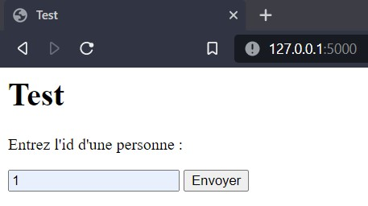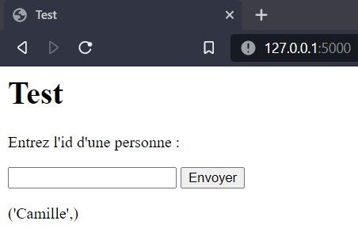

Cependant, il est possible d'afficher tous les noms des personnes en utilisant une injection SQL. Pour cela, il suffit de rajouter une condition après l'identifiant. Pour fonctionner, cette condition doit être vraie pour toutes les lignes de la table. Il peut aussi être nécessaire de rajouter des tirêts pour que la suite de la commande devienne un commentaire et ne soit pas pris en compte lors de l'exécution. Par exemple, le texte suivant est une injection SQL.
```
1 or 1=1; -- -
```

Si ce texte est inséré et envoyé, on obtient la page suivante. \
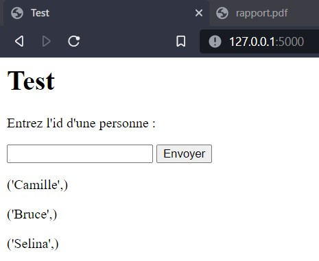

Dans l'exemple précédent, l'injection SQL permet l'affichage de plusieurs éléments alors que le programme utilisé normalement n'en affiche qu'un seul. Cependant, entrer le texte suivant aura pour conséquence, la suppression de la table ```personnes```.
```
1; delete from personnes where 1=1 -- -
```

Dans le cadre de travaux de recherche, la suppression des données peut avoir de grâves conséquences sur le projet. \
Pour éviter cela, j'ai dû rajouter un traîtement des éléments transmis par l'utilisateur pour que les requêtes ne contienne pas de caractères permettant les injections SQL.

La plupart des langages utilisés dans la programmation web possèdent une fonction destinée à effacer les injections SQL des éléments insérés par le client d'un site web. Etant donné que je n'ai pas trouvé ce type de fonction dans le langage python, j'ai dû trouver un autre moyen. \
Dans l'exemple précédent l'injection SQL est permise par l'éléments de comparaison ```or``` envoyé par le client de la page web. Utiliser la fonction ```replace()``` de la classe String avec les paramètre ```"or"``` et ```""``` permet de le supprimer de l'élément inséré par le client ([Code *2.6.2.1* #1](#code-2621--fichier-apppy-avec-les-éléments-pour-empêcher-une-injection-sql)).

Avec la modifiction du script Python, entrer l'injection SQL génère une erreur mais n'endomage pas la base de données. \
Concernant la plateforme Polluscope, le nombre de caractère à supprimer est plus important pour écarter la plupart des possiblités d'injection SQL.

### <violet>Étape 8 : Vérifier si les données insérée par le client sont déjà dans la base de données</violet>

Dans la mesure où les travaux de recherche nécessitent des mesures précises pour être fiables, j'ai considéré que l'insertion de doublons de données de pollution dans la base de données mettrait en péril les résultats des campagnes de ressencement de la pollution. Je suis donc parti du principe que les participants des campagnes pouvaient faire l'erreur d'insérer plusieurs fois un même fichier de donnée et que si cela se produit alors les scripts Python doivent le savoir et ne pas insérer les doublons dans la base de données. C'est un constat qui a été approuvé par mes encadrants.

J'ai considéré que le nom du fichier inséré et contenant les données de pollution n'est pas un élément de décision fiable car celui-ci peut être facilement modifié par le participant. \
Étant donnée que les fichier inséré par les clients de la plateforme sont enregistrés sur le serveur du laboratoire, dans une première version du programme, pour tester l'existance d'une ligne dans la base de donnée, le script Python testait si elle se trouvait parmis les lignes des fichiers précédemement insérés et stockés sur le serveur. Le pseudo code Python suivant illustre cette première méthode de vérification. La fonction prend en paramètre la ligne à insérer et une liste contenant toutes les lignes enregistrées (#1). Si la nouvelle ligne est présente dans la liste alors la fonction renvoie la valeur booléenne ```False``` (#2) et la valeur ```True``` dans le cas contraire (#3).

```py
def testNew(nouvelleLigne, toutesLesLignes): #1
    if nouvelleLigne in toutesLesLignes:
        return False #2
    return True #3
```
**Code 2.7.1.1 :** fonction ```testNew()```

Avec la fonction précédente, il est possible de placer l'instruction d'insertion dans une boucle conditionnelle (#1). L'insertion ne sera effectuée que si la nouvelle ligne n'est pas enregistée.

```py
if testNew(nouvelleLigne, toutesLesLignes) : #1
    inserer(nouvelleLigne)
```
**Code 2.7.1.2 :** boucle d'insertion conditionnelle

Néanmoins, comme l'ont remarqué mes encadrants, cette méthode est très coûteuse en mémoire pour l'ordinateur réalisant l'opération et l'utilisation de cette ressource augmente avec le nombre de ligne à comparer. Étant donné que, dans le cadre du projet Polluscope, ce nombre peut s'élever à plusieurs millions, cette méthode n'est pas applicable pour ce projet. J'ai donc dû trouver une autre méthode.

Mes encadrant m'ont alors suggéré d'utiliser les dates d'utilisation du capteur comme moyen de vérification. En effet, l'ensemble des capteurs, en plus de relever des données de pollution, mémorisent les dates auquels les données sont enregistrées. En ayant connaissance de l'identifiant du capteur, des dates auquel il a été utilisé et en sachant qu'un capteur ne peut être utilisé que par un seul participant à la fois, il est possible de savoir si une ligne à déjà été insérée. \
Pour ce faire, le script Python récupère grâce à une requête SQL l'intervalle d'utilisation d'un capteur en fonction de son identifiant.

```sql
select min(time), max(time) from sensor_measure where id='sensorId';
```
**Code 2.7.2.1 :** Requête permettant de connaître l'intervalle d'utilisation d'un capteur

On peut alors modifier la fonction ```testNew()``` pour que celle-ci vérifie si la date de la ligne à insérer est comprise dans cet intervalle (#1). Si tel est le cas alors la fonction renvoie la valeur ```False``` (#2) et la valeur ```True``` dans le cas contraire (#3).

```py
def testNew(dateNouvelleLigne, intervalleMin, intervalleMax):
    if intervalleMin < dateNouvelleLigne and dateNouvelleLigne < intervalleMax : #1
        return False #2
    return True #3
```
**Code 2.7.2.1 :** nouvelle version de la méthode ```testNew()```

Il s'agit d'une méthode de vérification nécessitant moins de ressouces de l'ordinateur, ce qui permet d'accélérer l'insertion de nouvelles lignes dans la base de données.

<div style="page-break-after: always"></div>

## <orange>II.D Les outils informatiques et techniques utilisés</orange>

Dans le cadre de mon travail durant ce stage, l'ordinateur personnel que je possède et utilise au quotidien pour mes études et mes activités dans le domaine de l'informatique est devenu mon principal outils de travail. Étant déjà familiarisé avec les environnements de développement créer par **JetBrains** tel que <und>PyCharm</und> mon choix s'est porté sur ceux-ci pour produire les logiciels et applications durant le stage. \
 \
Pendant toute la durée du stage, j'ai utilisé <und>Github</und> pour la gestion et le partage de versions des applications avec les membres de l'équipe car ceux-ci l'avait déjà utilisé auparavant. \
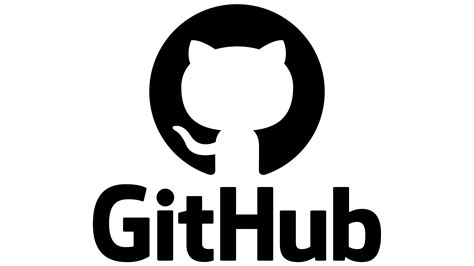 \
Comme évoqué dans la partie précédente, l'ensemble des données recueillies lors des campagnes de recensement sont stockées sur une base de données <und>PostgreSQL</und> appartenant au laboratoire. Afin de ne pas endommager, effacer ou modifier ces données lors du développement de la nouvelle version de la plateforme Polluscope, j'ai installé ce même système de gestion de base de données sur mon ordinateur personnel. Celle-ci a été utilisée pendant toute la durée de la création du nouveau site web du projet. \
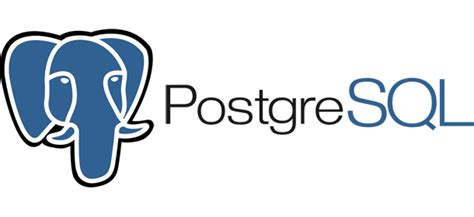 \
Tel que spécifié dans le sujet du stage, la plateforme Polluscope doit fonctionner avec le langage <und>Python</und>. Par conséquent, il a été nécessaire d'utiliser le framework <und>Flask</und>. Celui-ci permet le déploiement d'une application web sur un ordinateur en ayant seulement recours au langage Python et ne nécessite pas l'utilisation de logiciels d'hébergement de site internet tel que Apache ou Xampp. \
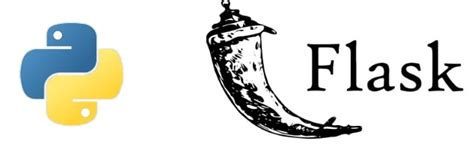 \
Aussi, pour faciliter le déploiement de l'application sur le serveur du laboratoire, l'équipe a exigé que l'acquisition des packages nécessaires et la mises en marche de la plateforme se fasse par l'utilisation de la technologie <und>Docker</und>. Cela permet de faire fonctionner le site internet sans avoir à installer les paquets de façon définitive sur le serveur et donc d'économiser de l'espace sur le disque dur de celui-ci. \
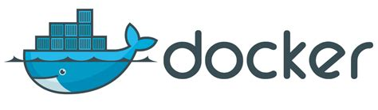

<div style="page-break-after: always"></div>

## <orange>II.E Méthodes, formations et autoformations suivies pour l'obtention de la solution</orange>

Comme évoquer auparavant ma première tâche à été de créer un programme générant automatiquement des rapports en <und>Markdown</und> avant de les convertir au format PDF. Étant déjà familiarisée avec ce premier je n'ai pas eu besoin d'apprendre la structure d'un fichier Markdown. En revanche, il a été nécessaire que je trouve des fonctions en Python permettant l'exportation du fichier au format souhaité.

Dans le cadre de la refactorisation de la plateforme Polluscope, je n'avais jusqu'alors jamais créé de site internet avec le framework Flask. Il a donc été nécessaire que j'apprenne et comprenne son fonctionnement avant de commencer à produire le code de la plateforme. Sachant cela et étant donnée que mes seules contraintes étaient l'utilisation d'un langage spécifique et l'achèvement de ce travail avant la fin du stage, j'ai utilisé une méthode de travail semblable à la méthode agile. Cela signifie les membres de l'équipe encadrant mon travail me demandaient régulièrement des retours sur l'avancée de mon travail en me suggérant des modifications ou des améliorations. Par exemple, cette méthode m'a permis de recevoir les retours de mes encadrants concernant une méthode de vérification d'insertion de données que j'avais créé et qui nécessitait des modification (voir [Étape 8 du développement de la plateforme](#violetétape-8--vérifier-si-les-données-insérée-par-le-client-sont-déjà-dans-la-base-de-donnéesviolet)). \
J'ai donc débuté mon travail de développement en contruisant des pages simples et en ajoutant des fonctionnalités au fur et à mesure de mon apprentissage. Toutefois, ayant déjà travaillé avec le langage Python, créer des applications web et étant désireux d'apprendre à utiliser de nouvelles technologies et préparé à cette éventualité, cette tâche s'est avéré être passionnante.

Une autre partie de mon travail a été de déployer la plateforme de données Polluscope sur le serveur du laboratoire en utilisant la technologie **Docker**. Pour comprendre son fonctionnement, j'ai eu recours aux lien présents en [sitographie](#sitographie) et j'ai été aidé par TAHER Yehia. J'ai également eu recours à ma machine virtuelle et à ma clé bootable, toutes deux sous Linux, pour tester le fonctionnement des conteneurs ainsi créés.

On peut constater que la plupart des tâches qui m'ont été confiée nécessite l'utilisation de technologies nouvelles ou peu utilisées. Toutefois, ma formation à l'IUT étant axée sur la pratique de la programmation par le développement et la recherche de documentation, l'utilisation de nouveaux langages ou de technologies de programmation spécifiques ne m'a pas posé de difficultés.

## <orange>II.F Résultats</orange>

Concernant le programme de génération automatique de rapport, celui-ci a pu être terminé au bout d'une semaine de travail. \

<div style="page-break-after: always"></div>

# Annexes

[**Code 2.1.1 :** fichier ```templates/index.html```](#code-211--fichier-templatesindexhtml)

[**Code 2.1.2 :** fichier ```app.py```](#code-212--fichier-apppy)

[**Code 2.2.1 :** fichier ```templates/index.html``` avec un formulaire](#code-221--fichier-templatesindexhtml-avec-un-formulaire)

[**Code 2.2.2 :** fichier ```app.py``` permettant de recevoir des éléments avec la méthode POST](#code-222--fichier-apppy-permettant-de-recevoir-des-éléments-avec-la-méthode-post)

[**Code 2.3.1 :** fichier ```templates/index.html``` avec un affichage conditionnel](#code-231--fichier-templatesindexhtml-avec-un-affichage-conditionnel)

[**Code 2.3.2 :** fichier ```app.py``` avec passage de paramètre par le dictionnaire ```post```](#code-232--fichier-apppy-avec-passage-de-paramètre-par-le-dictionnaire-post)

[**Code 2.4.1 :** fichier ```index.html``` avec un lien vers la page comportant l'URL ```page2```](#code-241--fichier-indexhtml-avec-un-lien-vers-la-page-comportant-lurl-page2)

[**Code 2.4.2 :** fichier ```page2.html``` accessible par un lien](#code-242--fichier-page2html-accessible-par-un-lien)

[**Code 2.4.3 :** fichier ```app.py``` avec la fonction ```page2``` permettant l'affichage de la page correspondant au fichier ```page2.html```](#code-243--fichier-apppy-avec-la-fonction-page2-permettant-laffichage-de-la-page-correspondant-au-fichier-page2html)

[**Code 2.6.1.1 :** fichier ```index.html```](#code-2611--fichier-indexhtml)

[**Code 2.6.1.2 :** fichier ```app.py```](#code-2612--fichier-apppy)

[**Code 2.6.2.1 :** fichier ```app.py``` avec les éléments pour empêcher une injection SQL](#code-2621--fichier-apppy-avec-les-éléments-pour-empêcher-une-injection-sql)

<div style="page-break-after: always"></div>

### **Code 2.1.1 :** fichier ```templates/index.html```
```html
<html>
    <head>
        <title>Test</title>
        <meta charset="utf-8" />
    </head>
    <body>
        <h1>Test</h1>
    </body>
</html>
```

### **Code 2.1.2 :** fichier ```app.py```
```py
from flask import *

app = Flask(__name__)

@app.route("/")
def main():
    return render_template("index.html")

if __name__ == "__main__" :
    app.run()
```

<div style="page-break-after: always"></div>

### **Code 2.2.1 :** fichier ```templates/index.html``` avec un formulaire
```html
<html>
    <head>
        <title>Test</title>
        <meta charset="utf-8" />
    </head>
    <body>
        <h1>Test</h1>
        <form action="" method="post"> #1
            <input type="text" name="text"> #2
            <input type="submit" name="submit"> #3
        </form>
    </body>
</html>
```

### **Code 2.2.2 :** fichier ```app.py``` permettant de recevoir des éléments avec la méthode POST
```py
from flask import *

app = Flask(__name__)

@app.route("/", methods=("GET", "POST")) #1
def main():
    if request.method == "POST": #3
        text = request.form["text"] #2
        print(text)
    return render_template("index.html")

if __name__ == "__main__" :
    app.run()
```

<div style="page-break-after: always"></div>

### **Code 2.3.1 :** fichier ```templates/index.html``` avec un affichage conditionnel
```html
<html>
    <head>
        <title>Test</title>
        <meta charset="utf-8" />
    </head>
    <body>
        <h1>Test</h1>
        <form action="" method="post">
            <input type="text" name="text">
            <input type="submit" name="submit">
        </form>

        

         #1
        <p>Texte entré : {{posts['text']}}</p> #2
        

        
    </body>
</html>
```

### **Code 2.3.2 :** fichier ```app.py``` avec passage de paramètre par le dictionnaire ```post```
```py
from flask import *

app = Flask(__name__)

@app.route("/", methods=("GET", "POST"))
def main():
    post = {} #1
    post['text'] = None #3
    if request.method == "POST":
        text = request.form["text"]
        post["text"] = text #2
    return render_template("index.html", posts = post) #4

if __name__ == "__main__" :
    app.run()
```

<div style="page-break-after: always"></div>

### **Code 2.4.1 :** fichier ```index.html``` avec un lien vers la page comportant l'URL ```page2```
```html
<html>
    <head>
        <title>Test</title>
        <meta charset="utf-8" />
    </head>
    <body>
        <h1>Ceci est la première page</h1>
        <li>
            <a href="{{ url_for('page2') }}"> #1
                lien vers la deuxième
            </a>
        </li>
    </body>
</html>
```

### **Code 2.4.2 :** fichier ```page2.html``` accessible par un lien
```html
<html>
    <head>
        <title>Test</title>
        <meta charset="utf-8" />
    </head>
    <body>
        <h1>Ceci est la deuxième page</h1>
    </body>
</html>
```

### **Code 2.4.3 :** fichier ```app.py``` avec la fonction ```page2``` permettant l'affichage de la page correspondant au fichier ```page2.html```
```py
from flask import *

app = Flask(__name__)

@app.route("/")
def main():
    return render_template("index.html")

@app.route("/page2") #2
def page2(): #1
    return render_template("page2.html")

if __name__ == "__main__" :
    app.run()
```

<div style="page-break-after: always"></div>

### **Code 2.6.1.1 :** fichier ```index.html```
```html
<html>
    <head>
        <title>Test</title>
        <meta charset="utf-8" />
    </head>
    <body>
        <h1>Test</h1>
        <form action="" method="post">
            <p>Entrez l'id d'une personne : </p>
            <input type="text" name="text">
            <input type="submit" name="submit">
        </form>

        

        
        <p>{{n}}</p>
        

        
    </body>
</html>
```

### **Code 2.6.1.2 :** fichier ```app.py```
```py
import psycopg2
from flask import *

app = Flask(__name__)

@app.route("/", methods=("GET", "POST"))
def main():
    post = {}
    if request.method == "POST": #2
        conn = psycopg2.connect(database="X", user="X", password="X", host="X") #1
        input = request.form["text"]
        query = "select nom from personnes where id="+input #3
        cur = conn.cursor()
        cur.execute(query) #4
        out = []
        for row in cur:
            out.append(row) #5
        post['name'] = out
    return render_template("index.html", posts=post) #6
    
if __name__ == "__main__" :
    app.run()
```

### **Code 2.6.2.1 :** fichier ```app.py``` avec les éléments pour empêcher une injection SQL
```py
import psycopg2
from flask import *

app = Flask(__name__)

@app.route("/", methods=("GET", "POST"))
def main():
    post = {}
    if request.method == "POST":
        conn = psycopg2.connect(database="X", user="X", password="X", host="X")
        input = request.form["text"]
        query = "select nom from personnes where id="+str(input).replace("or", "") #1
        print(query)
        cur = conn.cursor()
        cur.execute(query)
        out = []
        for row in cur:
            out.append(row)
        post['name'] = out
    return render_template("index.html", posts=post)

if __name__ == "__main__" :
    app.run()
```

<div style="page-break-after: always"></div>

# Joural des mises à jour de la plateforme de données Polluscope

commit 178435ef86259261af418fc2119bdcc03fb7b2e1 (HEAD -> main, origin/main, origin/HEAD)
Merge: 15c275d 577f917
Author: yureiiko <pierrefcz@gmail.com>
Date:   Mon May 16 11:13:26 2022 +0200

    Merge remote-tracking branch 'origin/main'

commit 15c275dec590bf56b413dc5be79421407b5da889
Author: yureiiko <pierrefcz@gmail.com>
Date:   Mon May 16 11:11:51 2022 +0200

    UPDATES :
    Addition of the page ```canarinFidas.html```. This page isn't working.
    Modifiation of all page's header.

commit 577f9173e9e3239bcead009c5e3de49c9ad0e87a
Author: yureiiko <101016323+yureiiko@users.noreply.github.com>
Date:   Fri May 13 11:35:56 2022 +0200

    Update README.md

commit b844daeeb08c43e040fcb228dca7be77ee90e489
Author: yureiiko <pierrefcz@gmail.com>
Date:   Fri May 13 11:33:46 2022 +0200

    UPDATES :
    Addition of the fonctional page ```uploadFidas.html```

commit ee638a00b0615215f5cf793a6cf9e90a1c6b6a1d
Author: yureiiko <101016323+yureiiko@users.noreply.github.com>
Date:   Thu May 12 11:42:02 2022 +0200

    Update README.md

commit e86f45c37cc002c5ec3f30d0953f249f89075e57
Author: yureiiko <pierrefcz@gmail.com>
Date:   Thu May 12 11:41:25 2022 +0200

    UPDATES :
    Addition of the fonctional page ```uploadTeom.html```

commit c04c95fbcf3d06a4823708ee6d749374a798933b
Author: yureiiko <101016323+yureiiko@users.noreply.github.com>
Date:   Tue May 10 11:32:28 2022 +0200

    Update README.md

commit e71c28c67f4d31cf1507ca4e273f88851ae97b92
Author: yureiiko <101016323+yureiiko@users.noreply.github.com>
Date:   Tue May 10 11:31:08 2022 +0200

    Update README.md

commit b413aa08ddfb8e8915b53eb73f5fe3dd868d4202
Author: yureiiko <101016323+yureiiko@users.noreply.github.com>
Date:   Tue May 10 11:15:05 2022 +0200

    Update README.md

commit 347520624453265a36c182d4cb4c7cc9f46e3485
Author: yureiiko <pierrefcz@gmail.com>
Date:   Tue May 10 11:14:08 2022 +0200

    UPDATES :
    Addition of the fonctional page ```downloadKitData.html```

commit b2555dddc115cbfcc3c86acac32510eacd555524
Author: yureiiko <101016323+yureiiko@users.noreply.github.com>
Date:   Mon May 9 16:22:18 2022 +0200

    Update README.md

commit 21589f36cc7404e8475d3f9a31eecab22cbc6b4e
Author: yureiiko <pierrefcz@gmail.com>
Date:   Mon May 9 16:21:14 2022 +0200

    UPDATES :
    Addition of the fonctional page ```downloadCampaignData.html```

commit a75faaf2c57ce109ddb39399e181d947db841840
Author: yureiiko <101016323+yureiiko@users.noreply.github.com>
Date:   Mon May 9 14:58:01 2022 +0200

    Update README.md

commit 821a6e42cf7e0cdce3bf7b82c0657660b1d716f7
Author: yureiiko <101016323+yureiiko@users.noreply.github.com>
Date:   Fri May 6 16:41:28 2022 +0200

    Update README.md

commit d2e4e88e4dbb892c003c7fd4d39d6c9f13da9d55
Author: yureiiko <pierrefcz@gmail.com>
Date:   Fri May 6 16:39:56 2022 +0200

    UPDATES :
    It's nom possible to use the ```downloadAssignedData.html``` page.

commit c9ae60910febb3e647440caeceb4ad4dabc867b8
Author: yureiiko <pierrefcz@gmail.com>
Date:   Fri May 6 12:32:46 2022 +0200

    UPDATES :
    Minor modifications to fix errors.

commit de5fc91cd81a80a06dce367c17432e0a74b67bec
Author: yureiiko <pierrefcz@gmail.com>
Date:   Thu May 5 12:01:50 2022 +0200

    UPDATES :
    Modifications on ```downloadAssignedData.html```.

commit 030f6f5afcd0cdc65f96680ed0232f605289f6dd
Author: yureiiko <101016323+yureiiko@users.noreply.github.com>
Date:   Thu May 5 11:37:47 2022 +0200

    Update README.md

commit 4cf594f5affb2fd1d0cb88946a51247ddfbd55a7
Author: yureiiko <101016323+yureiiko@users.noreply.github.com>
Date:   Thu May 5 11:10:43 2022 +0200

    Update README.md

commit 2ba62dca514a828a5a305842a525cf2c1d74c8c2
Author: yureiiko <101016323+yureiiko@users.noreply.github.com>
Date:   Thu May 5 11:08:26 2022 +0200

    Add files via upload

commit adbc5a91d2e59bc65d065d01819f44ed78e2e128
Author: yureiiko <101016323+yureiiko@users.noreply.github.com>
Date:   Thu May 5 11:06:52 2022 +0200

    Add files via upload

    UPDATE :
    The way to check if a row was already inserted change. Now the program check in fonction of the device's id and of the date.
    It's now possible to upload aethalometer, actris, report and to check the history of report uploading.

commit 572ca0e80cb7298128d506449200db9abe14d504
Author: yureiiko <101016323+yureiiko@users.noreply.github.com>
Date:   Mon May 2 16:35:04 2022 +0200

    Add files via upload

commit 2e847c0528d27a356fea61d06dd840f416458fa0
Author: yureiiko <101016323+yureiiko@users.noreply.github.com>
Date:   Mon May 2 16:34:31 2022 +0200

    Add files via upload

commit a285b3017d2d1c538e0f4f289d1df3764f897a93
Author: yureiiko <101016323+yureiiko@users.noreply.github.com>
Date:   Mon May 2 16:33:21 2022 +0200

    Update README.md

commit 9d434b36975f26a4f1e09b07f1c4f890891a6843
Author: yureiiko <101016323+yureiiko@users.noreply.github.com>
Date:   Mon May 2 16:32:07 2022 +0200

    Add files via upload

    UPDATE
    It's now possible to load reports, tablet's activity and tablet's events. All history for this loads can be seen by an admin.

commit e9d4405f6b1bd582b243782e4e6edcfef356ec78
Author: yureiiko <101016323+yureiiko@users.noreply.github.com>
Date:   Mon May 2 16:29:30 2022 +0200

    Add files via upload

commit 885e53518d98a412b0d9a1829428c00fcbcf7718
Author: yureiiko <101016323+yureiiko@users.noreply.github.com>
Date:   Mon May 2 16:28:20 2022 +0200

    Add files via upload

    Update
    new data folders

commit 9d17074065e3ad05fa1bf50717637f298ddf3766
Author: yureiiko <101016323+yureiiko@users.noreply.github.com>
Date:   Mon May 2 14:33:13 2022 +0200

    Update README.md

commit bc5dcfdadab917203a61ca6b3e428535079f9cc1
Author: yureiiko <101016323+yureiiko@users.noreply.github.com>
Date:   Mon May 2 14:32:55 2022 +0200

    Delete scriptPython directory

commit c1436feacb570ad9e3b3a22917722c6cb4a62bfa
Author: yureiiko <101016323+yureiiko@users.noreply.github.com>
Date:   Mon May 2 14:21:26 2022 +0200

    Update README.md

commit 999905ac6ff31a5778cb79f412018484bdbd1ed5
Author: yureiiko <101016323+yureiiko@users.noreply.github.com>
Date:   Fri Apr 29 17:37:54 2022 +0200

    Update README.md

commit f8759e0e11e6e561271cca86eb392cbd389b18bf
Author: yureiiko <101016323+yureiiko@users.noreply.github.com>
Date:   Fri Apr 29 17:37:29 2022 +0200

    Create README.md

commit 310e40980ea4cc5bb0b0358d21f631ca0221573f
Author: yureiiko <101016323+yureiiko@users.noreply.github.com>
Date:   Fri Apr 29 17:33:44 2022 +0200

    Add files via upload

    Updates
    Kits can be created.
    It's now possible to create link between campaign, participant and kit. When we associate a kit to a participant the old kit association is erased.
    The device id seeking is now based on this link.
    It's also possible to see the history of file uploading.

commit 58d107b8f3dfc7bfc778d2aa3390df5f23852a5d
Author: yureiiko <101016323+yureiiko@users.noreply.github.com>
Date:   Tue Apr 26 16:42:52 2022 +0200

    Add files via upload

    New functionnalities
    It's possible to add a user, a participant and to upload gps tablet files.

commit 1786bb3707a3c428d0e0e40a0f9cf3e3c9d7c5c4 (origin/pycharm)
Author: yureiiko <101016323+yureiiko@users.noreply.github.com>
Date:   Sun Apr 24 20:58:14 2022 +0200

    Add files via upload

    First Commit
    It's possible for the user to upload Diams, Cairsens and AE51 measures. The administrator can download uploaded files.

<div style="page-break-after: always"></div>

# Sitographie

Site Internet du laboratoire DAVID : https://www.david.uvsq.fr/accueil/

Site de présentation du projet Polluscope : http://polluscope.uvsq.fr/index.php/fr/

Liens utilisés pour l'apprentisage de **Python Flask** : \
- https://www.digitalocean.com/community/tutorials/how-to-make-a-web-application-using-flask-in-python-3
- https://pypi.org/project/Flask/
- https://openclassrooms.com/fr/courses/4425066-concevez-un-site-avec-flask/4525776-installez-flask

Liens utilisés pour l'apprentissage de la technologie **Docker** : \
- https://www.digitalocean.com/community/tutorials/how-to-build-and-deploy-a-flask-application-using-docker-on-ubuntu-20-04
- https://www.youtube.com/watch?v=SXB6KJ4u5vg
- https://www.youtube.com/watch?v=cWkmqZPWwiw

 # Bibliographie

 - Évaluation HCERES DAVID UVSQ 25 Mai 2018

<style>
    und { text-decoration: underline; }
    red { color: red; }
    orange { color: orange; }
    violet { color: #951986 }
    body {
        font-size: 12px;
    }
</style>