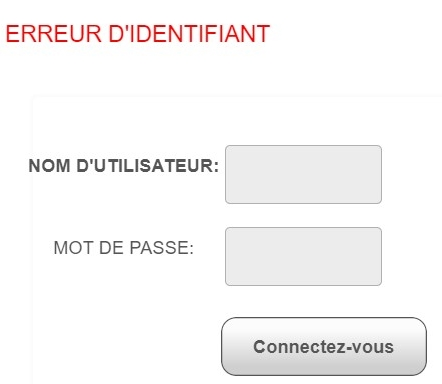

Nom : **FLEURY CALAIS** \
Prénom : **Pierre**

Année : **2021 - 2022**

<div style="text-align: center;"></div>

<div style="text-align: center; font-weight: bold; font-size: 18px;">Rapport de stage de deuxième année d'IUT Informatique</div><br>

<div style="text-align: center; font-size: 16px">Stage de développement web au laboratoire DAVID de l'UVSQ</div>

<div style="text-align: center;">4 avril 2022 - 15 juin 2022</div>

<div style="text-align: center;"></div>


Tutrice de stage : **ZEITOUNI Karine** \
Professeur encadrant : **HOGUIN Fabrice**

<div style="page-break-after: always"></div>

# Remerciements

Alors que le stage au laboratoire DAVID se termine, je tiens à remercier Karine ZEITOUNI pour avoir proposé ce stage et pour la confiance dont elle a fait preuve à mon égard pendant toute la période où j'ai travaillé à ses côtés. Je veux également remercier l'ensemble des membres du laboratoire DAVID pour m'avoir accueilli et pour tous les moments que l'on a passés ensemble.

<div style="page-break-after: always"></div>

**Sommaire**

- [Remerciement](#remerciement) page 1
- [Résumé / Summary](#résumé--summary) page 4
- [Introduction](#introduction) page 5
- [<red>I. Présentation de l'organisme d'accueil</red>](#redi-présentation-de-lorganisme-daccueilred) page 6
  - [<orange>I.A Historique</orange>](#orangeia-historiqueorange) page 6
  - [<orange>I.B Présentation juridique de l'organisme d'accueil</orange>](#orangeib-présentation-juridique-de-lorganisme-daccueilorange) page 6
  - [<orange>I.C Structure de l'organisme d'accueil</orange>](#orangeic-structure-de-lorganisme-daccueilorange) page 6
  - [<orange>I.D Présentation de l'équipe de travail</orange>](#orangeid-présentation-de-léquipe-de-travailorange) page 7
  - [<orange>I.E Étude de l'environnement économique de l'organisme d'accueil</orange>](#orangeie-étude-de-lenvironnement-économique-de-lorganisme-daccueilorange) page 8
    - [<violet>1) Analyse PESTEL de l'environnement du laboratoire DAVID</violet>](#violet1-analyse-pestel-de-lenvironnement-du-laboratoire-davidviolet) page 8
    - [<violet>2) Analyse SWOT du laboratoire DAVID</violet>](#violet2-analyse-swot-du-laboratoire-davidviolet) page 9
- [<red>II. Présentation du travail accompli durant le stage</red>](#redii-présentation-du-travail-accompli-durant-le-stagered) page 10
  - [<orange>II.A Présentation du Projet</orange>](#orangeiia-présentation-du-projetorange) page 10
  - [<orange>II.B Description du travail réalisé</orange>](#orangeiib-description-du-travail-réaliséorange) page 10
  - [<orange>II.C Description des problèmes à traiter et des solutions</orange>](#orangeiic-description-des-problèmes-à-traiter-et-des-solutionsorange) page 11
    - [<violet>Étape 1 : Comprendre la structure de la plateforme</violet>](#violetétape-1--comprendre-la-structure-de-la-plateformeviolet) page 11
    - [<violet>Étape 2 : Comprendre le fonctionnement basique de Python Flask</violet>](#violetétape-2--comprendre-le-fonctionnement-basique-de-python-flaskviolet) page 11
    - [<violet>Étape 3 : L'implémentation de la méthode POST avec Python Flask</violet>](#violetétape-3--limplémentation-de-la-méthode-post-avec-python-flaskviolet) page 12
    - [<violet>Étape 4 : Modifier la page web en fonction des actions de l'utilisateur</violet>](#violetétape-4--modifier-la-page-web-en-fonction-des-actions-de-lutilisateurviolet) page 13
    - [<violet>Étape 5 : Permettre le changement de page par l'utilisation de liens</violet>](#violetétape-5--permettre-le-changement-de-page-par-lutilisation-de-liensviolet) page 14
    - [<violet>Étape 6 : Permettre la connexion et les interactions avec la base de données PostgreSQL</violet>](#violetétape-6--permettre-la-connexion-et-les-interactions-avec-la-base-de-données-postgresqlviolet) page 15
    - [<violet>Étape 7 : Sécuriser les interactions avec la base de données</violet>](#violetétape-7--sécuriser-les-interactions-avec-la-base-de-donnéesviolet) page 16
    - [<violet>Étape 8 : Vérifier si les données insérée par le client sont déjà dans la base de données</violet>](#violetétape-8--vérifier-si-les-données-insérée-par-le-client-sont-déjà-dans-la-base-de-donnéesviolet) page 18
    - [<violet>Étape 9 : Créer et ajouter des graphes de visualisation des données</violet>](#violetétape-9--créer-et-ajouter-des-graphes-de-visualisation-des-donnéesviolet) page 20
  - [<orange>II.D Les outils informatiques et techniques utilisés</orange>](#orangeiid-les-outils-informatiques-et-techniques-utilisésorange) page 21
  - [<orange>II.E Méthodes, formations et autoformations suivies pour l'obtention de la solution</orange>](#orangeiie-méthodes-formations-et-autoformations-suivies-pour-lobtention-de-la-solutionorange) page 22
  - [<orange>II.F Résultats</orange>](#orangeiif-résultatsorange) page 22
- [<red>Conclusion</red>](#redconclusionred) page 23
- [Annexes](#annexes) page 24
    - [**Organigramme 1 :** Organigramme du laboratoire DAVID](#organigramme-1--organigramme-du-laboratoire-david) page 25
    - [**Code 2.1.1 :** fichier ```templates/index.html```](#code-211--fichier-templatesindexhtml) page 25
    - [**Code 2.1.2 :** fichier ```app.py```](#code-212--fichier-apppy) page 25
    - [**Code 2.2.1 :** fichier ```templates/index.html``` avec un formulaire](#code-221--fichier-templatesindexhtml-avec-un-formulaire) page 26
    - [**Code 2.2.2 :** fichier ```app.py``` permettant de recevoir des éléments avec la méthode POST](#code-222--fichier-apppy-permettant-de-recevoir-des-éléments-avec-la-méthode-post) page 26
    - [**Code 2.3.1 :** fichier ```templates/index.html``` avec un affichage conditionnel](#code-231--fichier-templatesindexhtml-avec-un-affichage-conditionnel) page 27
    - [**Code 2.3.2 :** fichier ```app.py``` avec passage de paramètre par le dictionnaire ```post```](#code-232--fichier-apppy-avec-passage-de-paramètre-par-le-dictionnaire-post) page 27
    - [**Code 2.4.1 :** fichier ```index.html``` avec un lien vers la page comportant l'URL ```page2```](#code-241--fichier-indexhtml-avec-un-lien-vers-la-page-comportant-lurl-page2) page 28
    - [**Code 2.4.2 :** fichier ```page2.html``` accessible par un lien](#code-242--fichier-page2html-accessible-par-un-lien) page 28
    - [**Code 2.4.3 :** fichier ```app.py``` avec la fonction ```page2``` permettant l'affichage de la page du fichier ```page2.html```](#code-243--fichier-apppy-avec-la-fonction-page2-permettant-laffichage-de-la-page-du-fichier-page2html) page 28
    - [**Code 2.6.1.1 :** fichier ```index.html```](#code-2611--fichier-indexhtml) page 29
    - [**Code 2.6.1.2 :** fichier ```app.py```](#code-2612--fichier-apppy) page 29
    - [**Code 2.6.2.1 :** fichier ```app.py``` avec les éléments pour empêcher une injection SQL](#code-2621--fichier-apppy-avec-les-éléments-pour-empêcher-une-injection-sql) page 30
  - [**Schéma 1 :** Structure de la plateforme de données Polluscope](#schéma-1--structure-de-la-plateforme-de-données-polluscope) page 31
  - [**Fichier 1 :** Fichier README du dépôt github contenant le code source de la plateforme Polluscope](#fichier-1--fichier-readme-du-dépôt-github-contenant-le-code-source-de-la-plateforme-polluscope) page 32
- [Glossaire](#glossaire) page 46
- [Sitographie](#sitographie) page 47
- [Bibliographie](#bibliographie) page 47

<div style="page-break-after: always"></div>

# Résumé / Summary

Je suis rentré au laboratoire DAVID de l'Université de Versailles-Saint-Quentin-en-Yvelines dans le cadre de mon stage de fin d'étude à l'IUT Informatique de Vélizy. Le stage a pour sujet <und>Développement d'interfaces de chargement, de prétraitement et de visualisation de données issues d'un capteur et d'une application mobile</und> et a commencé le 4 avril 2022. Il devait initialement se terminer le 27 mai mais il a été prolongé jusqu'au 15 juin pour me permettre d'achever pleinement mon travail. Durant cette période j'ai participé au projet de recherche Polluscope en créant un programme pour générer des rapports de façon automatique et en refactorisant la plateforme de données du projet Polluscope en langage Python Flask. Plus qu'une expérience dans le milieu professionnel en tant que membre actif du laboratoire, ce stage a été riche en apprentissage sur le plan technique et m'a permis de découvrir le monde de la recherche en rencontrant des personnes aux parcours variés mais partageant la même passion pour l'informatique 

I entered in the DAVID laboratory of the Université de Versailles-Saint-Quentin-en-Yvelines in the context of my internship of end studies in computer sciences at the IUT of Velizy. The internship subject is <und>Development of loading, pretreatement and visualization interface for data from sensor and of mobile application</und> and began the April 4th 2022. Initially it was suppose to last until the May 27th but was extended to the June 15th to allow me to fully achieve my work. During this time, I participated to the research project Polluscope by creating a program of auto report generation and by refactoring the Polluscope project's data platform in the Python Flask language. More than an experience in a professionnal environment as an active laboratory's member, this internship was rich in learning on the technical aspect and allowed me to discover the research world by meeting peoples with varied career history but sharing the same passion for computer sciences.

<div style="page-break-after: always"></div>

# Introduction

Le présent rapport a pour fonction de présenter l'entreprise ayant accepté de m'embaucher pour mon stage de fin d'étude en IUT informatique. L'ensemble des éléments de ce rapport sont accessibles via le dépôt Github présent en [sitographie](#sitographie). \
J'ai été accepté au **laboratoire DAVID de l'Université de Versailles-Saint-Quentin-en-Yvelines** en répondant à l'offre de stage <und>Développement d'interfaces de chargement, de prétraitement et de visualisation de données issues d'un capteur et d'une application mobile</und> de l'équipe ADAM. \
Ce stage a débuté le 4 avril 2022 et a duré deux mois. Ce stage constitue ma première expérience dans le milieu professionnel en tant que membre actif d'une organisation et a pour objectif de valider mes deux ans d'étude à l'IUT informatique de Vélizy et d'obtenir le Diplôme Universitaire de Technologie en Informatique. \
Dans un premier temps nous verrons une présentation du laboratoire DAVID de l'UVSQ avant de présenter le travail effectué durant la période de stage puis de finir par une conclusion récapitulant ce que le stage m'a appris et apporté.

<div style="page-break-after: always"></div>

# <red>I. Présentation de l'organisme d'accueil</red>

Dans cette partie, nous allons voir une présentation générale du laboratoire avant d'évoquer sa dimension juridique suivie de sa structure organisationnelle, d'une présentation de l'équipe avec laquelle j'ai effectué le stage pour finir avec une étude de l'environnement économique du laboratoire.

## <orange>I.A Historique</orange>


Le **laboratoire DAVID de l'Université de Versailles-Saint-Quentin-en-Yvelines** (Données et Algorithme pour une Ville Intelligente et Durable) se situe dans les bâtiments Descartes et Buffon du campus de l'Unité de Formation et de Recherche (UFR) des Sciences de la ville de Versailles (78000). Il a été fondé en juillet 2015 à l'initiative des membres du laboratoire PRISM pour créer un laboratoire spécialisé en algorithmique et en science de la donnée dont le principal objectif est de concevoir une ville  écologiquement responsable, durable et dotée d'infrastructures autonomes et intelligentes.


## <orange>I.B Présentation juridique de l'organisme d'accueil</orange>

Le laboratoire regroupe 60 chercheurs et doctorants spécialisés dans la recherche en informatique et plus particulièrement dans les domaines du big data, de la sécurité des données, de l'algorithmique, des réseaux de télécommunication et travail en interdisciplinarité avec la fédération **SIHS** (Sciences Informatiques, Humaines et Sociales) du CNRS dans l'objectif de concevoir une ville durable et intelligente. \
La majorité des ressources financières du laboratoire proviennent de l'État et varient en fonction de la période ou du nombre de projets en cours et du coût de ceux-ci. Dans le cas du projet de recherche Polluscope (voir [Présentation du projet](#orangeiia-présentation-du-projetorange)), celui-ci à généré une aide financière de 172 721 € provenant de l'État et des financements 694 988 € provenant des partenaires du laboratoire dans le cadre du projet.
La majorité des produits du laboratoire sont les publications scientifiques liées aux projets de recherches menés par les différentes équipes.

## <orange>I.C Structure de l'organisme d'accueil</orange>

La direction du laboratoire est assurée par le professeur **BARTH Dominique**, **KEDAD Zoubida** et **DUCOIN Chantal** ayant respectivement les postes de directeur du laboratoire, directrice adjointe et responsable administrative. La gestion des équipes de recherches du laboratoire est répartie entre **BARTH Dominique** pour l'équipe **ALMOST**, **ANCIAUX Nicolas** pour l'équipe **PETRUS** et **ZEITOUNI Karine** pour l'équipe **ADAM**. \
L'organigramme du laboratoire est disponible en [annexe](#annexes) et provient du site internet de ce dernier (voir [sitographie](#sitographie)).

<div style="page-break-after: always"></div>

## <orange>I.D Présentation de l'équipe de travail</orange>

Le laboratoire regroupe les équipes de recherches **ALMOST** (Algorithms and Stochastic Models), **PETRUS** (PErsonnal and TRUSted cloud), **NGN** (Next Generation Network) et **ADAM** (Ambient Data Access and Mining) avec laquelle j'ai réalisé le stage. Celles-ci sont majoritairement constituées de chercheurs ou d'étudiants doctorants et ont respectivement pour spécialités la résolution algorithmique et l'évaluation de performance, la structure, la gestion et la sécurisation de données personnelles, les réseaux et l'internet des objets et la modélisation de données hétérogènes.

Dans le cadre de mon stage, j'ai travaillé au sein de l'équipe ALMOST sous la direction de **ZEITOUNI Karine**, la cheffe du groupe et également ma tutrice de stage ainsi qu'une des professeurs rencontrées durant mes études à l'IUT informatique de Vélizy.


Elle fait partie des membres permanents de l'équipe au même titre **TAHER Yehia** (Maître de conférence), **YEH Laurent** (Maître de conférence). J'ai remarqué que parmi les membres permanents de l'équipe ADAM se trouvent **PREDA Nicoleta** et **LOYER Yann**, deux professeurs rencontrés durant mes études à l'IUT informatique de Vélizy.

Au sein de l'équipe, se trouvent également des étudiants doctorant ou post doctorant dont **BOUHAMOUM Redouane** un autre professeur de l'IUT de Vélizy. Par ailleurs, pendant la période de mon stage, deux membres du groupe de doctorants, **EL HAFYANI Hafsa** et **ZUO Jingwei**, ont soutenu leurs thèses devant un jury et obtenu le titre de Docteur en informatique. Quand le sujet de thèse est attribué à l'étudiant préparant un doctorat, il rejoint un des projets dont l'équipe est en charge. Celui-ci dépend du sujet de la thèse, de sa compatibilité avec le projet, et ce que l'étudiant peut apporter avec ses travaux de recherche.

Aussi, dans le cadre de certains projets ou pour des exigences précises, le laboratoire recrute des étudiants devant réaliser des stages en entreprises dans le cadre de leurs études. J'ai fait partie de cette catégorie en rejoignant le laboratoire, au même titre que **BADRA Riham**, une étudiante ayant rejoint l'équipe dans le cadre de son Master en Informatique. Étant donné que le laboratoire est en relation avec des universités à l'échelle mondiale, cela lui permet d'accueillir des étudiants stagiaires et doctorants venus du monde entier.

<div style="page-break-after: always"></div>

## <orange>I.E Étude de l'environnement économique de l'organisme d'accueil</orange>

Cette partie est entièrement dédiée à la présentation de l'environnement économique du laboratoire DAVID.

### <violet>1) Analyse PESTEL de l'environnement du laboratoire DAVID</violet>

L'ensemble des opportunités et menaces pesant sur le laboratoire DAVID sont résumées dans la matrice PESTEL ci-dessous. \
<und>PESTEL :</und> Politique, Économique, Socioculturel, Technologique, Environnemental, Légal

|Dimension  |Opportunité    |Menace |
|---|---|---|
|Politique|- la <und>loi de programmation de la recherche</und> promet 3% du PIB consacré à la recherche et une meilleure organisation de celle-ci|- depuis mai 2021, le <und>Plan National de Recherche</und> sélectionne les proposition de projet de recherche en fonction de leurs impacts sociétaux, ce qui réduit le nombre projets financés|
|Économique||- pénurie mondiale de composants informatiques en raison de la crise du Covid-19<br>- les fortes dettes de l'État réduisent les possibilités de financement|
|Socio-culturel|- prise de conscience de l'importance des principes du développement durable<br>- prise de conscience des enjeux environnementaux ||
|Technologique|- amélioration constante des technologies de l'information pour le public et les entreprises<br>- la quantité de donnée augmente constamment et des travaux de recherche sont nécessaire pour optimiser leur traitement<br>- de plus en plus d'appareils interagissent grâce à internet|- pénurie mondiale de composants informatiques en raison de la crise du Covid-19|
|Environnemental|- la dégradation de l'environnement nécessite des recherche pour en connaître les conséquences et les moyens de les diminuer|- on sait depuis peu de temps que le stockage massif de données est facteur d'augmentation de la pollution<br>- la production d'ordinateur a des conséquences néfastes sur l'environnement|
|Légale|||

**Tableau 1 :** Matrice PESTEL de l'environnement du laboratoire DAVID

L'actualité sur le plan technologique est globalement favorable au bon fonctionnement du laboratoire car l'utilisation massive des réseaux de télécommunication et des bases de données nécessite des travaux de recherche pour les rendre toujours plus performants. Néanmoins, d'un point de vue économique, étant donné les fortes dettes de l'État français, celui-ci possède moins d'argent pouvant être investi dans la recherche scientifique. De plus, les enjeux écologiques actuels nécessitent des travaux de recherche pour prévenir les conséquences de la pollution de l'air ou pour réduire l'impact des nouvelles technologies sur l'environnement.

<div style="page-break-after: always"></div>

### <violet>2) Analyse SWOT du laboratoire DAVID</violet>

<und>SWOT :</und> Strengths, Weaknesses, Opportunities, Threats (Forces, Faiblesses, Opportunités, Menaces)
L'ensemble des forces, faiblesses, opportunités et menaces du laboratoire DAVID sont résumés dans le tableau suivant et proviennent majoritairement du document d'évaluation HCERES de 2018 (voir [Bibliographie](#bibliographie)).

|Aspect |Description    |
|---|---|
|**Forces**|- spécialisation du laboratoire dans le domaine de l'informatique<br>- le laboratoire est en lien avec plusieurs centres de recherches de l'UVSQ et du territoire français<br>- le laboratoire est en lien avec des universités à l'échelle international (Liban, Chine ...) et accueil des étudiants et doctorants venus du monde entier<br>- les activités de recherche du laboratoire se basent sur plusieurs thèmes liés à des défis sociétaux majeurs<br>- collaboration avec des acteurs territoriaux au niveau des communautés d'agglomération, du département des Yvelines et de la région Ile-de-France|
|**Faiblesses**|- effectif réduit par rapport à d'autres laboratoires de recherches<br>- peu de moyens et absence de soutien politique de la part de l'UVSQ<br>- difficulté pour les membres du laboratoire à investir dans des projets de recherche|
|**Opportunités**|- le laboratoire de recherche **NIWC** (Naval Information Warfare Center) des États-Unis est à la recherches d'étudiants, doctorants et chercheurs compétents dans les domaines de l'informatiques, essentiellement dans le big data<br>- la <und>loi de programmation de la recherche</und> promet 3% du PIB consacré à la recherche et une meilleure organisation de celle-ci|
|**Menaces**|- depuis mai 2021 et l'apparition du <und>Plan National de Recherche</und>, le gouvernement sélectionne les projets de recherche en fonction de leurs impacts sociétaux, réduisant le nombre de projets financés<br>- baisse de motivation des membres du laboratoire dans l'investissement pour l'obtention des moyens de recherche| \
**Tableau 2 :** Matrices SWOT du laboratoire DAVID

En France, les principaux organismes de recherche sont l'**INRA** (Institut National de la Recherche Agronomique), l'**INSERM** (Institut National de la Santé Et de la Recherche Médicale) et le **CNRS** (Centre National de la Recherche Scientifique) reconnu par son nombre de publications scientifiques comme le premier organisme de recherche au monde. Ceux-ci sont les principaux concurrents du laboratoire DAVID dans la mesure où ils exercent tous dans le domaine de la recherche et aussi les principaux associés car certains projets, tel que le projet [Polluscope](#orangeiia-présentation-du-projetorange), se déroulent en collaboration avec ces organismes de recherches.


<div style="page-break-after: always"></div>

# <red>II. Présentation du travail accompli durant le stage</red>

Dans cette partie, nous allons évoqué le travail effectué durant le stage en commençant par une description du projet, suivi d'une description des tâches réalisées, d'une mise en évidence des principaux problèmes rencontrés, d'une présentation des outils utilisés, des méthodes et formations suivies pour finir par l'analyse des résultat de chaque tâches.

## <orange>II.A Présentation du Projet</orange>

Le stage s'est déroulé dans le cadre du projet de recherche **Polluscope** (voir [sitographie](#sitographie)) dont l'équipe ADAM du laboratoire DAVID est en charge depuis le 1er septembre 2016 jusqu'à la date limite prévue, le 31 décembre 2022. Réalisé en collaboration avec AirParis, Cerema Île-de-France, Versailles Grand Parc,
Sorbonne Médecine, Inserm, LSCE, EIVP et l'Agence Nationale de la Recherche, ce projet a pour objectif de mesurer l'exposition à la pollution de la population française au quotidien.


Pour ce faire, des campagnes de recensement sont régulièrement réalisées en région parisienne et marseillaise avec la participation de volontaires. Pour les besoins de l'expérience, chaque participant reçoit un ou plusieurs capteurs de pollution et une tablette pour relever leurs activités ainsi que leur position géographique. Les capteurs sont conçus pour mesurer le taux de différents gazs ou particules fines de différentes tailles dans l'air ambiant et transférer les données sur une application.

 \
**Photo 1 :** Capteur AE51 conçu pour mesurer le taux de suie dans l'air ambient

 \
**Photo 2 :** Capteur Cairsens conçu pour mesurer le taux de dioxyde d'azote (NO2) dans l'air ambient

 \
**Photo 3 :** Capteur Canarin conçu pour mesurer le taux de micro particules de différente taille dans l'air ambient (un capteur cairsens est attaché à droite)

 \
**Photo 4 :** Icon du capteur PMScan/Diams conçu pour mesurer les mêmes éléments que le capteur Canarin mais en relevant la position géographique

Celles-ci peuvent ensuite être téléchargées et déposées sur le site internet du projet pour être analysées et mises sous différentes formes. \
Dans certaines conditions, des stations fixes sont utilisées pour mesurer la pollution de l'air ambiant. Toutefois, dans la mesure où celles-ci sont difficiles à déplacer, elles sont surtout utilisées comme témoins de la pollution dans des zones rurales ou peu urbanisées.

## <orange>II.B Description du travail réalisé</orange>

Mon premier travail durant le stage est de créer le programme permettant la <und>génération des rapports</und>. La création des cartes et des graphes de visualisation de données ayant été réalisée en langage Python par **EL HAFYANI Hafsa**, je dois utiliser ce même langage pour créer des rapports de façon automatique. J'ai également pour contrainte de générer une première version des rapports en Markdown avant de les convertir en PDF. \
Une autre partie de mon travail est de créer une <und>nouvelle version de la plateforme de données Polluscope</und> permettant le dépôt des données de pollution, le téléchargement de fichiers de données et le téléchargement des rapports. Une première version du site à été codée en PHP par **TAHER Yehia**. Cependant, pour répondre à un besoin d'homogénéisation des langages utilisés, notamment par rapport à la génération automatique des rapport, il faut que je crée une version du site internet en utilisant les langages Python et HTML ainsi que le framework Flask et la base de données Postgres du laboratoire sur laquelle sont stockées les données de pollution. Cette refactorisation comprend l'intégration de pages de chargement des données des nouveaux capteurs. Il faut également que je déploie cette nouvelle version de la plateforme sur le serveur du laboratoire en utilisant la technologie Docker.

<div style="page-break-after: always"></div>

## <orange>II.C Description des problèmes à traiter et des solutions</orange>

Cette section du rapport est entièrement consacrée à la description détaillée des problèmes rencontrés durant la refactorisation de la plateforme de données Polluscope qui constitue mon travail le plus important durant le stage. Cette partie présente également les solutions découvertes ou mises au point pour résoudre ces problèmes.

Dans cette partie, les références aux portions code présents en annexes sont entre parenthèses.

### <violet>Étape 1 : Comprendre la structure de la plateforme</violet>

Étant donné qu'une première version de la plateforme à été créée en PHP par **TAHER Yehia** et **Ahmad Ktaish**, il fallait que je respecte la structure de l'application mais aussi sa charte graphique. Pour visualiser la structure du site internet et mieux comprendre son fonctionnement, j'ai créé un schéma comportant des balises représentant les différentes pages de la plateforme ainsi que les liens entre celles-ci. Ici le terme de structure est utilisé pour évoquer le comportement de la plateforme en fonction des actions de l'utilisateur et des pages sur lesquelles elles sont réalisées.

 \
**Schéma 1 :** Structure de la plateforme de données Polluscope

Ce schéma est également disponible en [annexe](#schéma-1--structure-de-la-plateforme-de-données-polluscope).

En examinant le code source de la plateforme, on constate qu'il est nécessaire d'avoir un compte enregistré dans la base de données pour utiliser les services du site internet. On peut également remarquer qu'un utilisateur peut avoir soit un rôle de participant, soit un rôle d'administrateur et que cela influe sur les actions réalisables par la personne qui se connecte à la plateforme et donc sur les pages qui lui sont accessibles. Dans le schéma précédent, les pages à gauche sont accessibles pour les participants, celles en bas au centre sont utilisables uniquement par les administrateurs et les autres sont accessibles pour tous les utilisateurs. Sur cette plateforme, seule la page ```login``` est accessible pour le grand public.

### <violet>Étape 2 : Comprendre le fonctionnement basique de Python Flask</violet>

Afin d'apprendre à créer un site internet en Python Flask j'ai recherché sur internet des contenus expliquant la structure et le fonctionnement de ce dernier. \
La liste des liens dont je me suis servi pour cette auto formation sont présents dans la [sitographie](#sitographie).

D'après mes recherches, la technologie Flask a un fonctionnement semblable au Design Pattern **Modele-View-Controller** (Modèle-Vue-Contrôleur) utilisé dans les langages de programmation orientés objets. En effet, l'affichage des pages codées en HTML ainsi que les actions de l'utilisateur sur celles-ci sont ou peuvent être entièrement ou partiellement gérées par un seul fichier codé en Python.

Les deux portions de code [*2.1.1*](#code-211--fichier-templatesindexhtml) et [*2.1.2*](#code-212--fichier-apppy) présentes en annexe, permettent l'affichage d'une pages web identique à celle de l'image suivante : \
 \
**Page Web 1 :** Page web basique avec Python Flask

Pour cela, le fichier ```index.html``` ([Code *2.1.1*](#code-211--fichier-templatesindexhtml)) doit être placé dans un répertoire **templates** avant d'exécuter le fichier ```app.py``` ([Code *2.1.2*](#code-212--fichier-apppy)). Cela permet d'ouvrir une fenêtre de terminal comportant les lignes suivantes :
```
* Serving Flask app 'app' (lazy loading)
 * Environment: production
   WARNING: This is a development server. Do not use it in a production deployment.
   Use a production WSGI server instead.
 * Debug mode: off
 * Running on http://127.0.0.1:5000 (Press CTRL+C to quit)
```
Pour afficher la page web il faut entrer l'URL fourni (ici ```http://127.0.0.1:5000```) dans un moteur de recherche.

En sachant cela, j'ai pu créer la page d'accueil de la plateforme du projet.

 \
**Page Web 2 :** Page d'accueil de la plateforme de données Polluscope

### <violet>Étape 3 : L'implémentation de la méthode POST avec Python Flask</violet>

D'après l'analyse de la plateforme, celle-ci comporte de nombreux formulaires nécessaires aux dépôt des données de pollution. Tout comme dans la première version du site internet, celui que j'ai créé doit permettre la transmission d'éléments insérés dans des formulaires au moyen de la méthode POST. \
En reprenant le code HTML vu précédemment on peut rajouter un formulaire ([Code *2.2.1* #1](#code-221--fichier-templatesindexhtml-avec-un-formulaire)) constitué d'une zone de texte ([Code *2.2.1* #2](#code-221--fichier-templatesindexhtml-avec-un-formulaire)) et d'un bouton de validation ([Code *2.2.1* #3](#code-221--fichier-templatesindexhtml-avec-un-formulaire)). La méthode ```main()``` du fichier ```app.py``` ([Code *2.2.2*](#code-222--fichier-apppy-permettant-de-recevoir-des-éléments-avec-la-méthode-post)) qui permet l'affichage de la page web est par défaut à l'écoute des actions réalisées sur ce formulaire.

Avec le nouveau fichier ```index.html``` ([Code *2.2.1*](#code-221--fichier-templatesindexhtml-avec-un-formulaire)), on obtient une page web identique à celle-ci :
 \
**Page Web 3 :** Page web avec un formulaire pour afficher du texte dans une fenêtre de terminal

Afin que le programme en Python puisse recevoir des éléments avec la méthode POST, celle-ci doit être spécifiée grâce à la méthode ```@app.route()``` ([Code *2.2.2* #1](#code-222--fichier-apppy-permettant-de-recevoir-des-éléments-avec-la-méthode-post)). Pour récupérer les éléments insérés dans le formulaire, il faut utiliser l'attribut ```form``` de l'objet ```request``` en spécifiant le nom de l'élément ([Code *2.2.2* #2](#code-222--fichier-apppy-permettant-de-recevoir-des-éléments-avec-la-méthode-post)) après avoir vérifié si la méthode POST est utilisée ([Code *2.2.2* #3](#code-222--fichier-apppy-permettant-de-recevoir-des-éléments-avec-la-méthode-post)).

Avec les deux dernières portions de code présentées précédemment, on peut entrer du texte dans la zone dédiée et l'envoyer pour que celui-ci soit affiché dans un terminal.

Comprendre le fonctionnement de la méthode POST m'a permis de d'implémenter une première version de la page de connexion sans utilisation de la base de données.

### <violet>Étape 4 : Modifier la page web en fonction des actions de l'utilisateur</violet>

Durant l'analyse de la première version du site internet, j'avais constaté que le programme en PHP permet l'affichage de texte sur les pages web pour indiquer si des erreurs ont eu lieu ou si une action s'est achevée correctement. Afin que cela soit possible dans la nouvelle version de la plateforme je devais trouver un moyen pour passer des éléments en paramètre des fonctions d'affichage des pages web. \
Pour ce faire, j'ai utilisé des éléments de syntaxe **Jinja** dans les pages web. Cela permet de créer des boucles ou des actions conditionnelles dans des pages codées en html. \
Dans le code [*2.3.1*](#code-231--fichier-templatesindexhtml-avec-un-affichage-conditionnel), si la fonction d'affichage de la page comporte un paramètre ```posts``` portant le label 'text' ([Code *2.3.1* #1](#code-231--fichier-templatesindexhtml-avec-un-affichage-conditionnel)) alors celui-ci est affiché sur la page web ([Code *2.3.1* #2](#code-231--fichier-templatesindexhtml-avec-un-affichage-conditionnel)).

Pour pouvoir passer un paramètre à la fonction d'affichage, un dictionnaire doit être instancié dans le script python ([Code *2.3.2* #1](#code-232--fichier-apppy-avec-passage-de-paramètre-par-le-dictionnaire-post)) et les éléments à passer en paramètre doivent être associés à la bonne clé ([Code *2.3.2* #2](#code-232--fichier-apppy-avec-passage-de-paramètre-par-le-dictionnaire-post)). Par défaut, l'élément associé à la clé doit être nul ([Code *2.3.2* #3](#code-232--fichier-apppy-avec-passage-de-paramètre-par-le-dictionnaire-post)) pour éviter des erreurs. Le dictionnaire doit ensuite être placé en paramètre de la méthode ```render_template()``` avec le nom approprié ([Code *2.3.2* #4](#code-232--fichier-apppy-avec-passage-de-paramètre-par-le-dictionnaire-post)).

Le code ainsi modifié permet d'afficher une page web similaire à la précédente mais à présent lorsque du texte est entré dans la zone appropriée et envoyé (#1), celui-ci est affiché dans le navigateur (#2). \
 #1
**Page Web 4 :** Page web avec un formulaire permettant d'entrer du texte


 #2
**Page Web 5 :** Page web affichant le texte entré dans le formulaire

L'affichage conditionnel sur des pages web m'a permis de modifier les pages accessibles aux utilisateurs en fonction de leurs rôle de participant ou d'administrateur ou d'afficher des messages d'erreur ou de réussite de certaines actions.

 \
**Page Web 6 :** Page d'accueil de la plateforme Polluscope après une erreur de connexion

### <violet>Étape 5 : Permettre le changement de page par l'utilisation de liens</violet>

La plateforme doit comporter un menu permettant l'accès à différentes pages en fonction des besoins de l'utilisateur et de ses actions à réaliser. Dans la version que j'ai créé, j'ai dû trouver une méthode permettant l'utilisation des liens spécifiés pour chaque fonction rattachée à chaque page. \
Pour ce faire, il faut utiliser un élément de syntaxe **Jinja** associé à la méthode ```url_for()``` ([Code *2.4.1* #1](#code-241--fichier-indexhtml-avec-un-lien-vers-la-page-comportant-lurl-page2)). Celle-ci doit avoir l'URL de la page souhaitée en paramètre.

Pour qu'une autre page HTML (ici celle du [Code *2.4.2*](#code-242--fichier-page2html-accessible-par-un-lien)) soit accessible par un lien, celle-ci doit être rattachée à une fonction ([Code *2.4.3* #1](#code-243--fichier-apppy-avec-la-fonction-page2-permettant-laffichage-de-la-page-correspondant-au-fichier-page2html)) et à un chemin d'accès ([Code *2.4.3* #2](#code-243--fichier-apppy-avec-la-fonction-page2-permettant-laffichage-de-la-page-correspondant-au-fichier-page2html)).

Les trois fichier permettent d'afficher une page comportant un titre et un lien. \
 \
**Page Web 7 :** Première page web avec un lien vers la deuxième page

Cliquer sur le lien permet d'afficher la deuxième page. \
 \
**Page Web 8 :** Deuxième page web accessible via la première

Avec ces éléments, j'ai pu créer le menu contenant les liens vers les différentes pages.

 \
**Page Web 9 :** Exemple de menu de la plateforme Polluscope

### <violet>Étape 6 : Permettre la connexion et les interactions avec la base de données PostgreSQL</violet>

Tout comme la première version de la plateforme, celle que j'ai créé doit pouvoir insérer, lire et modifier des éléments contenus dans une base de données PostgreSQL. \
Pour établir la connexion avec la base de données, il est possible d'utiliser la commande python suivante avec le nom de la base de données, le nom d'utilisateur, le mot de passe de l'utilisateur et l'adresse IP du serveur hébergeant le système de gestion de base de données.

```py
import psycopg2

conn = psycopg2.connect(database="nom_base_de_données", user="nom_utilisateur", password="mot_de_passe", host="adresse_ip")
```
**Code 2.5.1 :** Commande de connection à la base de données PostrgreSQL

Pour exécuter une commande sur la base de données, il faut écrire cette dernière dans un objet de type String (#1) et le passer en paramètre de la méthode ```execute()``` du curseur (#2), attribut de la connection précédemment établie (#3).

```py
import psycopg2

conn = psycopg2.connect(database="nom_base_de_données", user="nom_utilisateur", password="mot_de_passe", host="adresse_ip")

query = "select * from test" #1
cur  = conn.cursor() #3
cur.execute(query) #2
```
**Code 2.5.2 :** Script Python permettant l'exécution d'une commande SQL sur une base de données PostgreSQL

Les résultats des requêtes SQL sont stockés dans la variable curseur sous forme de tableau. Pour visualiser les ligne générées par la requête, il faut donc afficher chaque élément de la variable curseur (#1) grâce à une boucle (#2).

```py
import psycopg2

conn = psycopg2.connect(database="nom_base_de_données", user="nom_utilisateur", password="mot_de_passe", host="adresse_ip", port= "port")

query = "select * from test"
cur  = conn.cursor()
cur.execute(query)

for row in cur: #2
    print(row) #1
```
**Code 2.5.3 :** Script Python permettant l'exécution d'une requête SQL et l'affichage des lignes générées

```
Output :
['test1']
['test2']
['test3']
```

Pouvoir interagir avec la base de données m'a permis de créer une nouvelle version de la page de connexion en utilisant les logins et mots de passe stockés dans la base de données. J'ai également pu créer des scripts Python pour enregistrer les données de pollution mais aussi ajouter des utilisateurs, des capteurs, des kits ou des campagnes.

### <violet>Étape 7 : Sécuriser les interactions avec la base de données</violet>

D'après mon analyse du code source de la première version de la plateforme Polluscope, les requêtes utilisées pour insérer des éléments dans la base de données étaient exécutées sans être préparées. En tant que passionné de cybersécurité, je sais qu'une requête SQL non préparée est une faille de sécurité pouvant être utilisée à des fins malveillantes pour compromettre une base de données grâce à des **injections SQL**. Il était donc primordial que je corrige cette faille dans la nouvelle version du site internet.

Normalement, quand le client d'une page web insère un élément dans un champ prévu à cet effet tel qu'une zone de texte, celui-ci est récupéré et inséré dans la variable de type String qui constitue la commande SQL. Cette commande est ensuite exécutée sur la base de données. \
Dans les exemples suivants nous utiliserons la table ```personnes``` présentée ci-dessous :
```
 id |   nom
----+---------
  1 | Camille
  2 | Bruce
  3 | Selina
```

Les deux portions de code [*2.6.1.1*](#code-2611--fichier-indexhtml) et [*2.6.1.2*](#code-2612--fichier-apppy) présents en annexes, permettent l'affichage d'une page web avec un formulaire composé d'un champ texte. L'utilisateur doit entrer l'ID d'une personne dans le champ texte pour que le nom de cette personne s'affiche sur la page web ().

Le script Python établit la connexion avec la base de donnée ([Code *2.6.1.2* #1](#code-2612--fichier-apppy)) si il y a un élément transmis par la méthode POST ([Code *2.6.1.2* #2](#code-2612--fichier-apppy)). Une commande est ensuite créée avec l'id de la personne dont l'utilisateur veut afficher le nom ([Code *2.6.1.2* #3](#code-2612--fichier-apppy)). Une fois la commande exécutée ([Code *2.6.1.2* #4](#code-2612--fichier-apppy)), les résultats de la commande sont récupérés dans la variable ```out``` ([Code *2.6.1.2* #5](#code-2612--fichier-apppy)) et envoyés vers la page web par la méthode POST ([Code *2.6.1.2* #6](#code-2612--fichier-apppy)).

Si l'utilisateur entre l'id ```1``` alors le nom de ```Camille``` est affiché. \
 \
**Page Web 10 :** L'identifiant 1 est entré dans le formulaire

 \
**Page Web 11 :** Le nom de Cammile est affiché sur la page

Cependant, il est possible d'afficher tous les noms des personnes en utilisant une injection SQL. Pour cela, il suffit de rajouter une condition après l'identifiant. Pour fonctionner, cette condition doit être vraie pour toutes les lignes de la table. Il peut aussi être nécessaire de rajouter des tirêts pour que la suite de la commande devienne un commentaire et ne soit pas pris en compte lors de l'exécution. Par exemple, le texte suivant est une injection SQL.
```
1 or 1=1; -- -
```

Si ce texte est inséré et envoyé, on obtient la page suivante. \
 \
**Page Web 12 :** Tout les noms sont affichés grâce à l'injection SQL

Dans l'exemple précédent, l'injection SQL permet l'affichage de plusieurs éléments alors que le programme utilisé normalement n'en affiche qu'un seul. Cependant, entrer le texte suivant aura pour conséquence, la suppression de la table ```personnes```.
```
1; delete from personnes where 1=1 -- -
```

Dans le cadre de travaux de recherche, la suppression des données peut avoir de graves conséquences sur le projet. \
Pour éviter cela, j'ai dû rajouter un traitement des éléments transmis par l'utilisateur pour que les requêtes ne contiennent pas de caractères permettant les injections SQL.

La plupart des langages utilisés dans la programmation web possèdent une fonction destinée à effacer les injections SQL des éléments insérés par le client d'un site web. Etant donné que je n'ai pas trouvé ce type de fonction dans le langage python, j'ai dû trouver un autre moyen. \
Dans l'exemple précédent l'injection SQL est permise par l'élément de comparaison ```or``` envoyé par le client de la page web. Utiliser la fonction ```replace()``` de la classe String avec les paramètre ```"or"``` et ```""``` permet de le supprimer de l'élément inséré par le client ([Code *2.6.2.1* #1](#code-2621--fichier-apppy-avec-les-éléments-pour-empêcher-une-injection-sql)).

Avec la modification du script Python, entrer l'injection SQL génère une erreur mais n'endommage pas la base de données. \
Concernant la plateforme Polluscope, le nombre de caractères à supprimer est plus important pour écarter la plupart des possibilités d'injection SQL.

### <violet>Étape 8 : Vérifier si les données insérée par le client sont déjà dans la base de données</violet>

Dans la mesure où les travaux de recherche nécessitent des mesures précises pour être fiables, j'ai considéré que l'insertion de doublons de données de pollution dans la base de données mettrait en péril les résultats des campagnes de recensement de la pollution. Je suis donc parti du principe que les participants des campagnes pouvaient faire l'erreur d'insérer plusieurs fois un même fichier de données et que si cela se produit alors les scripts Python doivent le savoir et ne pas insérer les doublons dans la base de données. C'est un constat qui a été approuvé par mes encadrants.

J'ai considéré que le nom du fichier inséré et contenant les données de pollution n'est pas un élément de décision fiable car celui-ci peut être facilement modifié par le participant. \
Étant donnée que les fichiers insérés par les clients de la plateforme sont enregistrés sur le serveur du laboratoire, dans une première version du programme, pour tester l'existence d'une ligne dans la base de donnée, le script Python testait si elle se trouvait parmis les lignes des fichiers précédemment insérés et stockés sur le serveur. Le pseudo code Python suivant illustre cette première méthode de vérification. La fonction prend en paramètre la ligne à insérer et une liste contenant toutes les lignes enregistrées (#1). Si la nouvelle ligne est présente dans la liste alors la fonction renvoie la valeur booléenne ```False``` (#2) et la valeur ```True``` dans le cas contraire (#3).

```py
def testNew(nouvelleLigne, toutesLesLignes): #1
    if nouvelleLigne in toutesLesLignes:
        return False #2
    return True #3
```
**Code 2.7.1.1 :** fonction ```testNew()```

Avec la fonction précédente, il est possible de placer l'instruction d'insertion dans une boucle conditionnelle (#1). L'insertion ne sera effectuée que si la nouvelle ligne n'est pas enregistrée.

```py
if testNew(nouvelleLigne, toutesLesLignes) : #1
    inserer(nouvelleLigne)
```
**Code 2.7.1.2 :** boucle d'insertion conditionnelle

Néanmoins, comme l'ont remarqué mes encadrants, cette méthode est très coûteuse en mémoire pour l'ordinateur réalisant l'opération et l'utilisation de cette ressource augmente avec le nombre de ligne à comparer. Étant donné que, dans le cadre du projet Polluscope, ce nombre peut s'élever à plusieurs millions, cette méthode n'est pas applicable pour ce projet. J'ai donc dû trouver une autre méthode.

Mes encadrants m'ont alors suggéré d'utiliser les dates d'utilisation du capteur comme moyen de vérification. En effet, l'ensemble des capteurs, en plus de relever des données de pollution, mémorisent les dates auxquelles les données sont enregistrées. En ayant connaissance de l'identifiant du capteur, de l'intervalle pendant lequel il a été utilisé et en sachant qu'un capteur ne peut être utilisé que par un seul participant à la fois, il est possible de savoir si une ligne à déjà été insérée. \
Pour ce faire, le script Python récupère grâce à une requête SQL l'intervalle d'utilisation d'un capteur en fonction de son identifiant.

```sql
select min(time), max(time) from sensor_measure where id='sensorId';
```
**Code 2.7.2.1 :** Requête permettant de connaître l'intervalle d'utilisation d'un capteur

On peut alors modifier la fonction ```testNew()``` pour que celle-ci vérifie si la date de la ligne à insérer est comprise dans cet intervalle (#1). Si tel est le cas alors la fonction renvoie la valeur ```False``` (#2) et la valeur ```True``` dans le cas contraire (#3).

```py
def testNew(dateNouvelleLigne, intervalleMin, intervalleMax):
    if intervalleMin < dateNouvelleLigne and dateNouvelleLigne < intervalleMax : #1
        return False #2
    return True #3
```
**Code 2.7.2.1 :** nouvelle version de la méthode ```testNew()```

Il s'agit d'une méthode de vérification nécessitant moins de ressources de l'ordinateur, ce qui permet d'accélérer l'insertion de nouvelles lignes dans la base de données.

### <violet>Étape 9 : Créer et ajouter des graphes de visualisation des données</violet>

Peu avant la fin du stage, il m'a été demandé de rajouter des graphes et des cartes, créés avec le logiciel <und>Grafana</und>, à la plateforme Polluscope pour permettre la visualisation de données. Le programme de création des graphes avait été créé par **ABBOUD Mohammad** et des étudiant de l'université. Mon travail dans cette étape a donc été d'intégrer ce programme dans le code source de la plateforme Polluscope en faisant les modifications nécessaires.

Dans cette partie du travail la principale difficulté a été d'apporter des modifications au code déjà créé et d'en comprendre les erreurs. En effet, pour interagir avec le logiciel Grafana, le programme utilise le package ```requests``` pour envoyer des requêtes vers l'ordinateur sur lequel ce premier est installé et en obtenir les réponses. Il s'agit d'une librairie que je n'avais alors jamais utilisé et dont les erreurs peuvent être incomprises et mener la personne en charge du développement vers de fausses réflexions.

Aussi, les données utilisées pour générer les graphes proviennent de requêtes SQL transmises au logiciel par l'intermédiaire d'un ou plusieurs fichiers JSON. Or ces fichier ont été écrits avec des requêtes permettant l'extraction d'informations d'une base de données selon un modèle créé au début du projet. Celui-ci a ensuite été mis à jour, ce qui rend les fichiers JSON inutilisables. Il a donc été nécessaire que je modifie les requêtes SQL de ces fichier pour rendre possible les interations avec la base de données et donc l'affichage de graphes.

 \
**Page Web 13 :** Exemple de graphe généré sur Grafana

A la demande de ZEITOUNI Karine, la génération des graphes m'a permis de réaliser un contrôle de la qualité des données recueillies par les capteurs PMScan / Diams lors de la campagne de recesement de pollution réalisée durant le mois de mai. Cela a pour objectif de mettre en évidence des dysfonctionnements sur certains capteurs. Ceux-ci sont censés fonctionner et recueillir des données de pollution pendant sept jours. Ainsi, des absences de données peuvent être décelées grâces aux graphes et imposé une réparation ou un remplacement de matériel.

Le rapport sur la qualité des données des capteurs PMScan est disponible dans le répertoire ```quality_check``` sur le dépôt Github du présent rapport (voir [sitographie](#sitographie)).

<div style="page-break-after: always"></div>

## <orange>II.D Les outils informatiques et techniques utilisés</orange>

Dans le cadre de mon travail durant ce stage, l'ordinateur personnel que je possède et utilise au quotidien pour mes études et mes activités dans le domaine de l'informatique est devenu mon principal outil de travail. Étant déjà familiarisé avec les environnements de développement créer par **JetBrains** tel que <und>PyCharm</und> mon choix s'est porté sur ceux-ci pour produire les logiciels et applications durant le stage. \
 \
Pendant toute la durée du stage, j'ai utilisé <und>Github</und> pour la gestion et le partage de versions des applications avec les membres de l'équipe car ceux-ci l'avait déjà utilisé auparavant. L'historique des implémentations est disponible [ici](#joural-des-mises-à-jour-de-la-plateforme-de-données-polluscope) en annexes. \
 \
Comme évoqué dans la partie précédente, l'ensemble des données recueillies lors des campagnes de recensement sont stockées sur une base de données <und>PostgreSQL</und> appartenant au laboratoire. Afin de ne pas endommager, effacer ou modifier ces données lors du développement de la nouvelle version de la plateforme Polluscope, j'ai installé ce même système de gestion de base de données sur mon ordinateur personnel. Celle-ci a été utilisée pendant toute la durée de la création du nouveau site web du projet. \
 \
Tel que spécifié dans le sujet du stage, la plateforme Polluscope doit fonctionner avec le langage <und>Python</und>. Par conséquent, il a été nécessaire d'utiliser le framework <und>Flask</und>. Celui-ci permet le déploiement d'une application web sur un ordinateur en ayant seulement recours au langage Python et ne nécessite pas l'utilisation de logiciels d'hébergement de site internet tel que Apache pour fonctionner. De plus pour rendre les données recueillies visibles et compréhensibes, il m'était demandé que j'utilise l'outil de visualisation de données <und>Grafana</und>. Cela a permis la création de graphes ou de cartes avec les données de pollution relevées ainsi que leurs coordonnées. \
Aussi, pour faciliter le déploiement de l'application sur le serveur du laboratoire, l'équipe a exigé que l'acquisition des packages nécessaires et la mises en marche de la plateforme se fasse par l'utilisation de la technologie <und>Docker</und>. Cela permet de faire fonctionner le site internet sans avoir à installer les paquets de façon définitive sur le serveur et donc d'économiser de l'espace sur le disque dur de celui-ci. \
  

<div style="page-break-after: always"></div>

## <orange>II.E Méthodes, formations et autoformations suivies pour l'obtention de la solution</orange>

Comme évoqué auparavant ma première tâche à été de créer un programme générant automatiquement des rapports en <und>Markdown</und> avant de les convertir au format PDF. Étant déjà familiarisé avec ce premier je n'ai pas eu besoin d'apprendre la structure d'un fichier Markdown. En revanche, il a été nécessaire que je trouve des fonctions en Python permettant l'exportation du fichier au format souhaité.

Dans le cadre de la refactorisation de la plateforme Polluscope, je n'avais jusqu'alors jamais créé de site internet avec le framework Flask. Il a donc été nécessaire que j'apprenne et comprenne son fonctionnement avant de commencer à produire le code de la plateforme. Sachant cela et étant donné que mes seules contraintes étaient l'utilisation d'un langage spécifique et l'achèvement de ce travail avant la fin du stage, j'ai utilisé une méthode de travail semblable à la méthode agile. Cela signifie que les membres de l'équipe encadrant mon travail me demandaient régulièrement des retours sur l'avancée de mon travail en me suggérant des modifications ou des améliorations. Par exemple, cette méthode m'a permis de recevoir les retours de mes encadrants concernant une méthode de vérification d'insertion de données que j'avais créé et qui nécessitait des modification (voir [Étape 8 du développement de la plateforme](#violetétape-8--vérifier-si-les-données-insérée-par-le-client-sont-déjà-dans-la-base-de-donnéesviolet)). \
J'ai donc débuté mon travail de développement en contruisant des pages simples et en ajoutant des fonctionnalités au fur et à mesure de mon apprentissage. Toutefois, ayant déjà travaillé avec le langage Python, créer des applications web et étant désireux d'apprendre à utiliser de nouvelles technologies et préparé à cette éventualité, cette tâche s'est avéré être passionnante.

Une autre partie de mon travail a été de déployer la plateforme de données Polluscope sur le serveur du laboratoire en utilisant la technologie **Docker**. Pour comprendre son fonctionnement, j'ai eu recours aux lien présents en [sitographie](#sitographie) et j'ai été aidé par TAHER Yehia. J'ai également eu recours à ma machine virtuelle et à ma clé bootable, toutes deux sous Linux, pour tester le fonctionnement des conteneurs ainsi créés.

On peut constater que la plupart des tâches qui m'ont été confiée nécessite l'utilisation de technologies nouvelles ou peu utilisées. Toutefois, ma formation à l'IUT étant axée sur la pratique de la programmation par le développement et la recherche de documentation, l'utilisation de nouveaux langages ou de technologies de programmation spécifiques ne m'a pas posé de difficultés.

## <orange>II.F Résultats</orange>

Concernant le programme de génération automatique de rapport, celui-ci a pu être terminé au bout d'une semaine de travail ce qui m'a permis d'entamer très vite la refactorisation de la plateforme Polluscope. \
Cela a constitué la partie la plus importante de mon travail et également la plus longue. La refactorisation de la plateforme ainsi que l'ajout des pages permettant le chargement des données des nouveaux capteurs a commencé le 11 avril, au début de la deuxième semaine de stage, et s'est déroulé jusqu'à la fin du stage. La création des fichiers permettant le fonctionnement d'une image Docker hébergeant la plateforme a nécessité deux jours de travail durant la semaine de l'Ascension. Néanmoins, ayant peu de connaissances concerant la mise en place de cette technologie, c'est une tâche qui a été reprise par TAHER Yehia. Il m'était également demandé d'intégrer la génération de rapport dans la plateforme de données. Néanmoins, en raison du départ de EL HAFYANI Hafsa et de la complexité de son code intégré dans les scripts Python que j'ai créé, c'est une tâche que je n'ai pu accomplir. \
Pour des raisons de santé et d'obligations liées à la poursuite d'étude j'ai été absent pendant cinq jours durant le stage. Mon stage a donc été prolongé d'une semaine en premier lieu, puis de quinze jours. Cela m'a permis d'apporter de nouvelles fonctionnalités à la plateforme et également de corriger des dysfonctionnements. La plateforme Polluscope sera sûrement amenée à évoluer pendant la suite du projet de recherche et je reste par conséquent à disposition des membres de l'équipe ADAM pour leur apporter mon aide dans l'amélioration de la plateforme Polluscope

<div style="page-break-after: always"></div>

# <red>Conclusion</red>

Mon choix de stage en entreprise s'est porté sur l'offre proposée par ZEITOUNI Karine car l'utilisation de technologies ou de langages peu connus dans le domaine de l'informatique faisait partie intégrante du sujet du stage et du travail à réaliser durant celui-ci. J'y ai vu une opportunité pour continuer d'acquérir des compétences en informatique tout en participant à un projet de recherche. Il s'agit d'une opportunité dont je n'aurais peut être pas bénéficié dans une autre entreprise. \
L'apprentissage de nouvelles technologies a rajouté une difficulé au travail à réaliser car il fallu que je me forme a leurs utilisations. Toutefois, étant avide d'acquérir de nouvelles connaissances et compétences, cette tâche ne m'a pas posé de grandes difficultés et s'est avérée être passionnante. \
Le principal objectif du stage était de refactoriser la plateforme de données Polluscope en utilisant la technologie Flask et le langage Python. Celui-ci a été accompli au même titre que le programme permettant la génération automatique des rapport sur l'expostion à la pollution. \
À l'heure actuel, j'ai l'intention de poursuivre mes étude en école d'ingénieur. Néanmoins, si j'envisage de réaliser une thèse dans le domaine de l'informatique alors peut être que j'intergrerai le laboratoire DAVID pour mener les travaux de recherche. \


<div style="page-break-after: always"></div>

# Annexes

[**Organigramme 1 :** Organigramme du laboratoire DAVID](#organigramme-1--organigramme-du-laboratoire-david)

[**Code 2.1.1 :** fichier ```templates/index.html```](#code-211--fichier-templatesindexhtml)

[**Code 2.1.2 :** fichier ```app.py```](#code-212--fichier-apppy)

[**Code 2.2.1 :** fichier ```templates/index.html``` avec un formulaire](#code-221--fichier-templatesindexhtml-avec-un-formulaire)

[**Code 2.2.2 :** fichier ```app.py``` permettant de recevoir des éléments avec la méthode POST](#code-222--fichier-apppy-permettant-de-recevoir-des-éléments-avec-la-méthode-post)

[**Code 2.3.1 :** fichier ```templates/index.html``` avec un affichage conditionnel](#code-231--fichier-templatesindexhtml-avec-un-affichage-conditionnel)

[**Code 2.3.2 :** fichier ```app.py``` avec passage de paramètre par le dictionnaire ```post```](#code-232--fichier-apppy-avec-passage-de-paramètre-par-le-dictionnaire-post)

[**Code 2.4.1 :** fichier ```index.html``` avec un lien vers la page comportant l'URL ```page2```](#code-241--fichier-indexhtml-avec-un-lien-vers-la-page-comportant-lurl-page2)

[**Code 2.4.2 :** fichier ```page2.html``` accessible par un lien](#code-242--fichier-page2html-accessible-par-un-lien)

[**Code 2.4.3 :** fichier ```app.py``` avec la fonction ```page2``` permettant l'affichage de la page correspondant au fichier ```page2.html```](#code-243--fichier-apppy-avec-la-fonction-page2-permettant-laffichage-de-la-page-correspondant-au-fichier-page2html)

[**Code 2.6.1.1 :** fichier ```index.html```](#code-2611--fichier-indexhtml)

[**Code 2.6.1.2 :** fichier ```app.py```](#code-2612--fichier-apppy)

[**Code 2.6.2.1 :** fichier ```app.py``` avec les éléments pour empêcher une injection SQL](#code-2621--fichier-apppy-avec-les-éléments-pour-empêcher-une-injection-sql)

[**Schéma 1 :** Structure de la plateforme de données Polluscope](#schéma-1--structure-de-la-plateforme-de-données-polluscope)

<div style="page-break-after: always"></div>

### **Organigramme 1 :** Organigramme du laboratoire DAVID


### **Code 2.1.1 :** fichier ```templates/index.html```
```html
<html>
    <head>
        <title>Test</title>
        <meta charset="utf-8" />
    </head>
    <body>
        <h1>Test</h1>
    </body>
</html>
```

### **Code 2.1.2 :** fichier ```app.py```
```py
from flask import *

app = Flask(__name__)

@app.route("/")
def main():
    return render_template("index.html")

if __name__ == "__main__" :
    app.run()
```

<div style="page-break-after: always"></div>

### **Code 2.2.1 :** fichier ```templates/index.html``` avec un formulaire
```html
<html>
    <head>
        <title>Test</title>
        <meta charset="utf-8" />
    </head>
    <body>
        <h1>Test</h1>
        <form action="" method="post"> #1 un formulaire
            <input type="text" name="text"> #2 avec une zone de texte
            <input type="submit" name="submit"> #3 et un bouton de validation
        </form>
    </body>
</html>
```

### **Code 2.2.2 :** fichier ```app.py``` permettant de recevoir des éléments avec la méthode POST
```py
from flask import *

app = Flask(__name__)

@app.route("/", methods=("GET", "POST")) #1 La fonction peut utiliser les méthodes GET et POST
def main():
    if request.method == "POST": #3 Si la méthode post est utilisée
        text = request.form["text"] #2 le texte inséré dans le formulaire est récupéré
        print(text)
    return render_template("index.html")

if __name__ == "__main__" :
    app.run()
```

<div style="page-break-after: always"></div>

### **Code 2.3.1 :** fichier ```templates/index.html``` avec un affichage conditionnel
```html
<html>
    <head>
        <title>Test</title>
        <meta charset="utf-8" />
    </head>
    <body>
        <h1>Test</h1>
        <form action="" method="post">
            <input type="text" name="text">
            <input type="submit" name="submit">
        </form>

        

         #1 Si il y a un paramètre post avec le label 'text'
        <p>Texte entré : {{posts['text']}}</p> #2 alors celui-ci est affiché sur la page
        

        
    </body>
</html>
```

### **Code 2.3.2 :** fichier ```app.py``` avec passage de paramètre par le dictionnaire ```post```
```py
from flask import *

app = Flask(__name__)

@app.route("/", methods=("GET", "POST"))
def main():
    post = {} #1 Un dictionnaire est instancié
    post['text'] = None #3 Par défaut l'élément associé à la clé est nul
    if request.method == "POST":
        text = request.form["text"]
        post["text"] = text #2 Les éléments a passer en paramètre doivent être associés à la bonne clé
    return render_template("index.html", posts = post) #4 dictionnaire doit ensuite être placé en paramètre de la fonction d'affichage

if __name__ == "__main__" :
    app.run()
```

<div style="page-break-after: always"></div>

### **Code 2.4.1 :** fichier ```index.html``` avec un lien vers la page comportant l'URL ```page2```
```html
<html>
    <head>
        <title>Test</title>
        <meta charset="utf-8" />
    </head>
    <body>
        <h1>Ceci est la première page</h1>
        <li>
            <a href="{{ url_for('page2') }}"> #1 élément de synthaxe Jinja associé à la méthode url_for()
                lien vers la deuxième
            </a>
        </li>
    </body>
</html>
```

### **Code 2.4.2 :** fichier ```page2.html``` accessible par un lien
```html
<html>
    <head>
        <title>Test</title>
        <meta charset="utf-8" />
    </head>
    <body>
        <h1>Ceci est la deuxième page</h1>
    </body>
</html>
```

### **Code 2.4.3 :** fichier ```app.py``` avec la fonction ```page2``` permettant l'affichage de la page du fichier ```page2.html```
```py
from flask import *

app = Flask(__name__)

@app.route("/")
def main():
    return render_template("index.html")

@app.route("/page2") #2 le chemin d'accès vers la deuxième page
def page2(): #1 la fonction permettant l'affichage de la deuxième page
    return render_template("page2.html")

if __name__ == "__main__" :
    app.run()
```

<div style="page-break-after: always"></div>

### **Code 2.6.1.1 :** fichier ```index.html```
```html
<html>
    <head>
        <title>Test</title>
        <meta charset="utf-8" />
    </head>
    <body>
        <h1>Test</h1>
        <form action="" method="post">
            <p>Entrez l'id d'une personne : </p>
            <input type="text" name="text">
            <input type="submit" name="submit">
        </form>

        

        
        <p>{{n}}</p>
        

        
    </body>
</html>
```

### **Code 2.6.1.2 :** fichier ```app.py```
```py
import psycopg2
from flask import *

app = Flask(__name__)

@app.route("/", methods=("GET", "POST"))
def main():
    post = {}
    if request.method == "POST": #2 si la méthode POST est utilisée
        conn = psycopg2.connect(database="X", user="X", password="X", host="X") #1 une connexion est établie avec la base de données
        input = request.form["text"]
        query = "select nom from personnes where id="+input #3 la requête selectionne le nom de la personne en fonction de son identifiant
        cur = conn.cursor()
        cur.execute(query) #4 la requête est exécutée ...
        out = []
        for row in cur:
            out.append(row) #5 ... et son résultat est stocké dans la variable out ...
        post['name'] = out
    return render_template("index.html", posts=post) #6 ... et envoyé vers la page web
    
if __name__ == "__main__" :
    app.run()
```

### **Code 2.6.2.1 :** fichier ```app.py``` avec les éléments pour empêcher une injection SQL
```py
import psycopg2
from flask import *

app = Flask(__name__)

@app.route("/", methods=("GET", "POST"))
def main():
    post = {}
    if request.method == "POST":
        conn = psycopg2.connect(database="X", user="X", password="X", host="X")
        input = request.form["text"]
        query = "select nom from personnes where id="+str(input).replace("or", "") #1 la fonction replace permet de supprimer la chaîne de caractère "or" de l'élément envoyé par l'utilisateur
        print(query)
        cur = conn.cursor()
        cur.execute(query)
        out = []
        for row in cur:
            out.append(row)
        post['name'] = out
    return render_template("index.html", posts=post)

if __name__ == "__main__" :
    app.run()
```

<div style="page-break-after: always"></div>

## **Schéma 1 :** Structure de la plateforme de données Polluscope
<br><br><br><br><br><br><br><br><br><br><br><br><br><br><br><br><br><br>


<div style="page-break-after: always"></div>

## **Fichier 1 :** Fichier README du dépôt github contenant le code source de la plateforme Polluscope

    # Polluscope

    The code in the main branch can be used on any device with python3 and all packages installed.

    **Required Packages :**
    - flask
    - flask_session
    - pathlib
    - pandas
    - werkzeug.utils
    - datetime
    - pyscopg2
    - configparser
    - gunicorn

    It's important to modifie lines in the file ```database.ini``` to make possible a connection to your own PostgreSQL database. SQL queries in the file ```creation.sql``` will create all necessary tables in your data base. Use queries in ```delete.sql``` to erase all tables and in ```insert_basic.sql``` to create an admin user for the platform.

    Before launch the application for the first time, be sure that all data repositories in ```data``` folder are empty. Before launch the app check the ```data``` repository contains all repositories in the following list and create them else :
    - actris
    - ae51
    - aethalometer
    - cairsens
    - canarin
    - diams
    - flow
    - report
    - tablet_activity
    - tablet_event
    - tablet_gps
    - teom

    To launch the web application on the computer in development mod you have to run the python file ```app.py```.

    To launch the web application on a server for deployement, you have to use the command ```gunicorn --bind 0.0.0.0:5000 app:app```

    **Unfonctional pages :**
    - canarinTeom
    - canarinFidas
    - cairsensActris
    - ae51Aethalometer

<div style="page-break-after: always"></div>

# Glossaire

**Déploiement :** Installation des composants d'une ou plusieurs applications dans un environnement de production.

**Plateforme (informatique) :** Environnement servant d'interface pour l'utilisation ou la gestion de services.

**Injection SQL :** Type d'attaque sur une application reliée à une base de données permettant à l'attaquant d'insérer et d'exécuter des commande SQL.

**SQLi :** Faille de sécurité permettant l'injection de commandes SQL.

<div style="page-break-after: always"></div>

# Sitographie

Site Internet du laboratoire DAVID : <https://www.david.uvsq.fr/accueil/>

Site de présentation du projet Polluscope : <http://polluscope.uvsq.fr/index.php/fr/>

Dépot Github de la plateforme Polluscope : <https://github.com/yureiiko/pollu.git> (pour des questions de confidentialité, ce dépôt est privé)

Dépôt Github du rapport de stage : <https://github.com/yureiiko/david_internship_report.git> (ce dépôt deviendra privé après la soutenance de stage)

Liens utilisés pour l'apprentisage de **Python Flask** :
- <https://www.digitalocean.com/community/tutorials/how-to-make-a-web-application-using-flask-in-python-3>
- <https://pypi.org/project/Flask/>
- <https://openclassrooms.com/fr/courses/4425066-concevez-un-site-avec-flask/4525776-installez-flask>
- <https://sysadmin.cyklodev.com/deployer-une-application-flask/>
- <https://pythondex.com/convert-gpx-to-csv-python>

Liens utilisés pour l'apprentissage de la technologie **Docker** :
- <https://www.digitalocean.com/community/tutorials/how-to-build-and-deploy-a-flask-application-using-docker-on-ubuntu-20-04>
- <https://www.youtube.com/watch?v=SXB6KJ4u5vg>
- <https://www.youtube.com/watch?v=cWkmqZPWwiw>
- <https://linuxhint.com/install_docker_kali_linux/>

# Bibliographie

- Évaluation HCERES DAVID UVSQ 25 Mai 2018

<style>
    und { text-decoration: underline; }
    red { color: red; }
    orange { color: orange; }
    violet { color: #951986 }
    body {
        font-size: 12px;
    }
    img.resize {
        max-width:100%;
        max-height:100%;
    }
    img.down {
        max-width:50%;
        max-height:50%;
    }
</style>